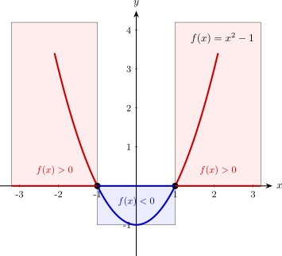
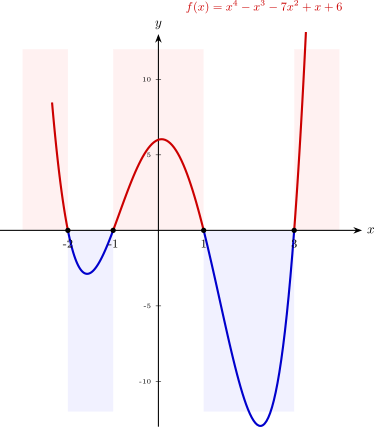

# Càlculs bàsics per trobar dominis

Per trobar el domini d'una funció, sovint ens cal determinar quins valors d'$x$ fan que una expressió sigui zero o positiva. Això es redueix a resoldre equacions i inequacions, i molts cops, aquestes són polinòmiques.

## 1. Resolució d'equacions polinòmiques (trobar zeros del polinomi)

Trobar els zeros d'un polinomi $P(x)$ és essencial per a les **funcions racionals** $f(x) = \displaystyle\frac{Q(x)}{P(x)}$. En aquests casos, el domini són tots els reals tret dels zeros del polinomi: $Dom(f)=\mathbb{R} \setminus \{x \mid P(x)=0\}$.

**Passos per resoldre equacions polinòmiques:**

1. **Factor comú:** Si el polinomi no té terme independent, treiem factor comú $x$ (això vol dir que $\mathbf{x=0}$ és solució).
2. **Equacions de 2n grau:** Si el que tenim o ens queda és una equació de 2n grau, utilitzem la fórmula general:
   
$$\displaystyle x = \frac{-b \pm \sqrt{b^2 - 4ac}}{2a}$$

3. **Ruffini:** Per a polinomis de grau 3 o superior, fem servir el mètode de Ruffini per trobar les arrels del polinomi.

> **Exemple:**  
> 
> Volem trobar el domini de $f(x) = \displaystyle\frac{1}{x^2 - 4}$.  
> Primer busquem els zeros de $p(x)=x^2-4$ per excloure'ls del domini:
> 
> $$x^2 - 4 = 0\implies x =\pm \sqrt{4}=\pm 2$$ 
>> Resultat: $Dom(f) = \mathbb{R} \setminus \{-2, 2\}$.

---

>**Exemple:**

>Volem trobar el domini de $f(x) =\displaystyle \frac{5}{x^3 - 4x^2 + 4x}$

>Busquem els valors que anul·len el denominador per excloure'ls del domini:

>$$x^3 - 4x^2 + 4x = 0$$

>**Pas 1: Extreure factor comú**
>Com que no hi ha terme independent, podem treure la $x$:

>$$x \cdot (x^2 - 4x + 4) = 0$$

>D'aquí ja obtenim la primera solució: **$x_1 = 0$**.

>**Pas 2: Resoldre el parèntesi (2n grau)**
>Ara treballem amb $x^2 - 4x + 4 = 0$:

>$$x = \frac{-(-4) \pm \sqrt{(-4)^2 - 4 \cdot 1 \cdot 4}}{2 \cdot 1} = \frac{4 \pm \sqrt{16-16}}{2} = \frac{4 \pm 0}{2} = 2$$

>Obtenim una solució doble: **$x_2 = 2$**.

> >**Resultat:** El domini són tots els reals menys els punts on el denominador és zero.

> >$$Dom(f) = \mathbb{R} \setminus \{0, 2\}$$

---

## 2. Resolució d'inequacions polinòmiques

Les inequacions són la clau per trobar el domini de les **funcions irracionals** o les **logarítmiques**: 

* Si $f(x) = \sqrt[n]{P(x)}$ amb $n$ senar, necessitem que $P(x) \ge 0$
* Si $g(x) = \log_b{Q(x)}$ , necessitem que $Q(x) > 0$.

**Estudi per intervals (signe del polinomi)**

Per resoldre inequacions podem seguir el següent procediment:

1. **Trobar els zeros** del polinomi (com hem fet a l'apartat anterior).
2. **Dividir la recta real en intervals** usant aquests zeros com a punts de tall.
3. **Trobar el signe de la funció en cada interval**. Per fer-ho prenem un valor qualsevol, $x_0$, de cada interval i mirem si $f(x_0)$ és positiu ($+$) o negatiu ($-$).
   
Amb això trobarem tots els intervals on el polinomi pren valors positius o negatius. Els extrems de cada interval són els punts on el polinomi val zero.

>**Exemple** 
>
Volem trobar el domini de $f(x) = \sqrt{x^2 - 1}$.  
>El domini seran els valors que compleixin: $p(x)=x^2 - 1 \ge 0$:

>Procediment:

>1. Trobem els zeros de $x^2-1$ $\implies$ $x \in \{-1,1\}$
>2. Dividim la recta reals en intervals a partir dels zeros trobats: $(-\infty, -1)$, $(-1, 1)$ i $(1, +\infty)$.
>3. Estudiem el signe en cada interval prenent un punt qualsevol de l'interval i mirant quin signe pren:
    * Per a $x = -2\rightarrow$ $p(-2)=(-2)^2 - 1 = 3 > 0 \rightarrow$ $(+)$
    * Per a $x = 0\rightarrow$ $p(0)=0^2 - 1 = -1 < 0 \rightarrow$ $(-)$
    * Per a $x = 2\rightarrow$ $p(2)=2^2 - 1 = 3 > 0\rightarrow$ $(+)$

>Gràficament:
>{width=65%}
>> **Resultat:** El domini són els intervals on es prenen valors positius o zero: $Dom(f) = (-\infty, -1] \cup [1, +\infty)$.

---

>**Exemple: funció radical amb polinomi de grau 4. Ruffini i inequació d'intervals**
>
>Trobem del domini de: $f(x) = \sqrt{x^4 - x^3 - 7x^2 + x + 6}$

>Com que és una arrel quadrada (arrel d'índex parell), el contingut ha de ser positiu o zero: $P(x) \ge 0$.
>La primera part del problema és trobar els zeros del polinomi:

>**Pas 1: Trobar els zeros amb Ruffini**

>**Provem amb $x = 1$:**
>
>| | 1 | -1 | -7 | 1 | 6 |
>| :--- | :--- | :--- | :--- | :--- | :--- |
>| **1** | | 1 | 0 | -7 | -6 |
>| | **1** | **0** | **-7** | **-6** | **0** $\leftarrow$ |

>**Provem amb $x = -1$ sobre el resultat anterior:**

>| | 1 | 0 | -7 | -6 |
>| :--- | :--- | :--- | :--- | :--- |
>| **-1** | | -1 | 1 | 6 |
>| | **1** | **-1** | **-6** | **0** $\leftarrow$ |

>Observem que ja hem trobat dos zeros $\mathbf{x_1 = -1, \,\, x_2 = 1}$ i ens queda estudiar el polinomi $x^2 - x - 6$

>**Pas 2: Equació de 2n grau**  
>Ens cal resoldre $x^2 - x - 6 = 0$. Apliquem la fòrmula:

>$$x =\displaystyle \frac{1 \pm \sqrt{1 - 4(1)(-6)}}{2} = \frac{1 \pm 5}{2} \implies \mathbf{x_3 = 3, \,\, x_4 = -2}$$

>Un cop hem trobat totes les arrels del polinomi, ens toca trobar en quins intervals la funció pren valors positius o zero:

>**Pas 3: Estudi del signe (intervals)**
>Dividim la recta real amb intervals a partir dels zeros obtinguts: $\{-2, -1, 1, 3\}$ i mirem el signe de $P(x)$ en cada interval:

>| Interval | Punt de prova | Substitució en $P(x)$ | Signe | Inclòs? |
>| :--- | :--- | :--- | :--- | :--- |
>| $(-\infty, -2)$ | $x = -3$ | $P(-3) = 48$ | **$+$** | **SÍ** |
>| $(-2, -1)$ | $x = -1.5$ | $P(-1.5) = -1.3$ | **$-$** | NO |
>| $(-1, 1)$ | $x = 0$ | $P(0) = 6$ | **$+$** | **SÍ** |
>| $(1, 3)$ | $x = 2$ | $P(2) =-12$ | **$-$** | NO |
>| $(3, +\infty)$ | $x = 4$ | $P(4) = 90$ | **$+$** | **SÍ** |

>Gràficament:
>{width=65%}

> >**Resultat:** 
> >
> >Unim els intervals on el signe és positiu o zero (on existeix l'arrel).
> >
> >$$Dom(f) = (-\infty, -2] \cup [-1, 1] \cup [3, +\infty)$$
> 
> 

---

## 3. Resum d'operacions segons el tipus de funció
| Tipus de Funció | Condició de Domini | Operació Matemàtica |
| :--- | :--- | :--- |
| **Racional**: $\displaystyle\frac{Q(x)}{P(x)}$ | $P(x) \neq 0$ | Equació |
| **Irracional**: $\sqrt{P(x)}$ | $P(x) \ge 0$ | Inequació |
| **Logarítmica**: $\log(P(x))$ | $P(x) > 0$ | Inequació (estricta) |