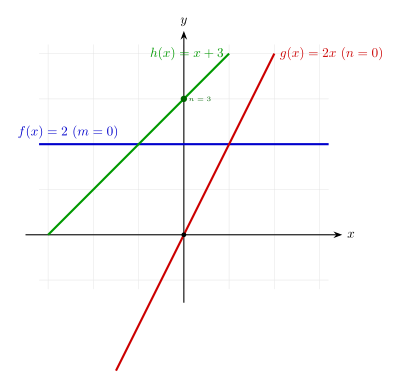
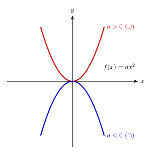
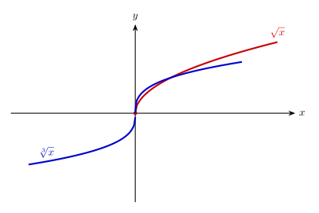
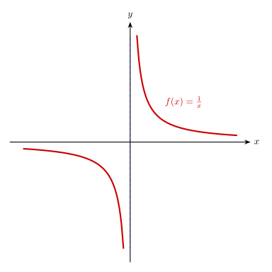
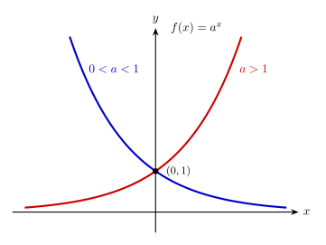
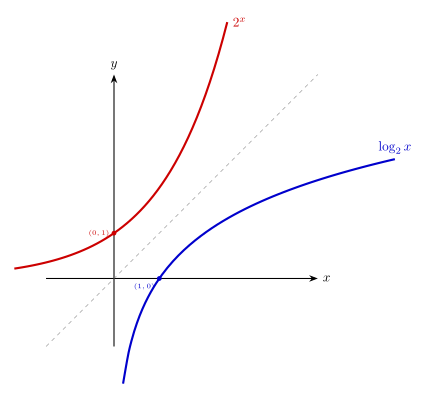
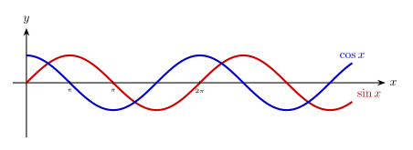
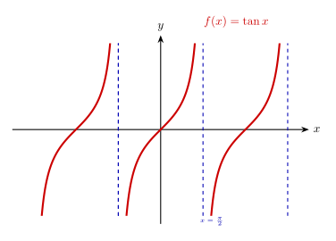
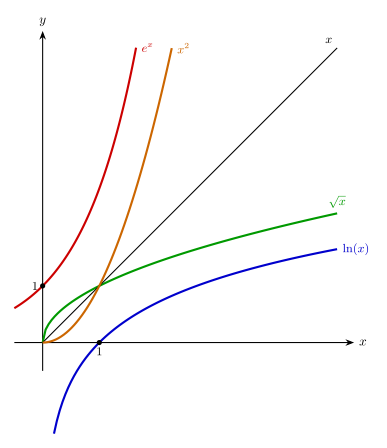
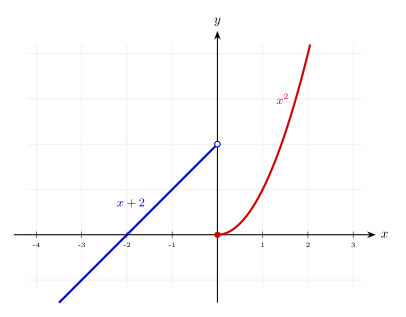

# Les funcions elementals

En aquest apartat farem una relació de les famílies de funcions elementals a partir de les quals obtindrem la resta de funcions. Entendre la seva expressió analítica, el domini i la seva gràfica és el pas previ a l'estudi de funcions més complexes.
També inclourem el concepte de funció definida a trossos.

---

## 1. Funcions Lineals
Són les més senzilles i la seva representació és una línia recta. Són polinomis de 1r grau.

* **Expressió:** $f(x) = mx + n$
* **Domini:** $Dom(f) = \mathbb{R}$
* **Cas particular:** Si $m=0$, la funció és **constant** ($f(x) = n$), i és una recta horitzontal.

En un context més avançat distingim 2 casos:
 
* Quan $n=0$ tenim $f(x) = mx$ i parlem pròpiament de **funcions lineals** o de proporció directa.
* Quan $n \ne 0$  tenim $f(x) = mx+n$ i en diem **funcions afins**.

> **Exemple:**
> 
> Observem les gràfiques dels tres casos: 
> 
> * $f(x)=2$ és una funció constant ($m=0$), el valor de la imatge sempre és 2 per qualsevol valor d'$x$.
> * $g(x)=2x$ és una recta que passa per l'origen ($n=0$) i és pròpiament una funció lineal.
> * $h(x)=x+3$ és una funció afí.
> {width=60%}

---

## 2. Funcions Quadràtiques
Són polinomis de 2n grau i la seva representació gràfica és una paràbola. El vèrtex i la curvatura depenen dels seus coeficients.

* **Expressió:** $f(x) = ax^2 + bx + c$
* **Domini:** $Dom(f) = \mathbb{R}$
* **Punts clau:** El vèrtex (el màxim o el mínim) es troba a $x =\displaystyle\frac{-b}{2a}$.
  
    Quan $a>0$ són còncanves ($\cup$) i quan $a<0$ són convexes ($\cap$).

> **Exemple:**
>
> Observem la gràfica de la funció $f(x)=ax^2$ com a exemple de funció còncava i convexa en funció del signe d'$a$.
> {width=50%}

---

## 3 Funcions Polinòmiques
Com el seu nom indica, són polinomis (de qualsevol grau). Òbviament inclouen els casos anteriors.

* **Expressió:** $f(x) = a_n x^n + a_{n-1} x^{n-1} + \dots + a_0$
* **Domini:** $Dom(f) = \mathbb{R}$ (tots els polinomis tenen domini real complet).
* **Forma:** Depèn del grau $n$. Com més gran és el grau, més "girs" o canvis entre concavitat i convexitat pot tenir la gràfica (màxim $n-1$).

---

## 4. Funcions Radicals o Irracionals
Són les funcions $\sqrt[n]{x}$. El domini d'aquestes funcions depèn de si l'índex de l'arrel és parell o senar.

**Casos habituals:**

| Tipus | Índex | Domini | Gràfica |
| :--- | :--- | :--- | :--- |
| **Quadrada** | Parell: $\sqrt{x}$ | $x \ge 0$ | Mitja paràbola horitzontal |
| **Cúbica** | Senar: $\sqrt[3]{x}$ | $\mathbb{R}$| "S" estirada (infinites) |

> **Exemple:**
>
> Observem la gràfica de $\sqrt{x}$ i $\sqrt[3]{x}$ i com el domini en el cas de l'arrel cúbica són tots els reals i, en canvi, en el cas de la quadrada només està definida per als reals positius i zero.  
> {width=60%}

---

## 5. Funcions de proporció inversa
Són funcions on la variable $x$ es troba al denominador.

* **Expressió:** $f(x) = \displaystyle\frac{k}{x}$
* **Domini:** $Dom(f) = \mathbb{R} \setminus \{0\}$
* **Característica:** En $x=0$, que és on s'anula el denominador, tenen una asímptota vertical (línia vertical a les quals la funció s'apropa, però mai arriba i tendeixen a infinit).

> **Exemple:**
>
> Una cosa que aprendrem de les funcions que anul·len el denominador en algun punt (i no el numerador) és que ens apareixen asímptotes verticals, o sigui, rectes verticals (en el nostre cas $x=0$) on la funció s'apropa sense arribar mai a tocar-la. Això fa que la funció marxi cap a valors infinitament grans o petits.
> {width=50%}

---

## 6. Funcions Exponencials
Creixen o decreixen de forma extremadament ràpida.

* **Expressió:** $f(x) = a^x$ (amb $a > 0$ i $a \neq 1$)
* **Domini:** $Dom(f) = \mathbb{R}$
* **Punt fix:** Totes passen pel punt $(0, 1)$, ja que $a^0 = 1$.

> **Exemple:**
>
> Observem la gràfica de la funció exponencial $f(x)=ax^2$ depenent de si $0<a<1$ o $a>1$.
> {width=50%}

---

## 7. Funcions Logarítmiques
Són les inverses de les exponencials.

* **Expressió:** $f(x) = \log_a(x)$
* **Domini:** $Dom(f) = (0, +\infty)$ (No existeixen logaritmes de nombres negatius o zero).
* **Punt fix:** Totes passen pel punt $(1, 0)$, ja que $\log_a(1)=0$.

> **Gràfica:**
>
> Observem les gràfiques de la funció exponencial ($2^x$) i logarítmica ($log_2(x)$) i com són simètriques respecte de $f(x)=x$.També podem veure com a la funció logarítmica ens apareix una asímptota vertical a quan el logaritme s'apropa al zero. 
> {width=50%}

---

## 8. Funcions Trigonomètriques
Descriuen moviments periòdics i oscil·lacions.

| Funció | Expressió | Domini | Recorregut o imatge|
| :--- | :--- | :--- | :--- |
| **Sinus** | $f(x) = \sin(x)$ | $\mathbb{R}$ | $[-1, 1]$ |
| **Cosinus** | $f(x) = \cos(x)$ | $\mathbb{R}$ | $[-1, 1]$ |
| **Tangent** | $f(x) = \tan(x)$ | $\mathbb{R} \setminus \{\frac{\pi}{2} + k\pi\}$ | $\mathbb{R}$ |

> **Gràfiques:**
>
> Observem la periodicitat de les gràfiques de la funció $sin(x)$ i $cos(x)$ i com una està deplaçada $\displaystyle\frac{\pi}{2} rad$ respecte l'altra.
>
> A la funció $tan(x)$ observem com apareixen les asímptotes verticals en els punts on s'anul·la el denominador, o sigui el cosinus.
> {width=60%}
> {width=55%}

---

## Comparativa de les gràfiques de les funcions

> En la comparativa gràfica de les funcions ja podem observar com és el creixement de les diferents funcions. Les funcions polinòmiques creixent més ràpidament com més gran és el seu grau (aquí s'inclouen les funcions irracionals tenint en compte el seu exponent fraccionari). En el cas de l'exponencial i la logarítmica ja veiem que són la més ràpida i la més lenta respectivament pel que fa a creixement.
> 
> $$e^x \gg x^2 \gg x \gg \sqrt{x} \gg \ln x$$
> 
> {width=45%}

---

## Funcions Definides a Trossos
Una funció definida a trossos utilitza diferents expressions analítiques segons l'interval de l'eix $x$ on ens trobem.O sigui, són funcions que no segueixen una única fórmula per a tot el seu domini, sinó que canvien d'expressió segons el valor de la variable $x$. Cada "tros" té el seu propi interval de definició.

* **Expressió:** $f(x) = \begin{cases} f_1(x) & \text{si } x \in I_1 \\ f_2(x) & \text{si } x \in I_2 \\ ... \\ f_n(x) & \text{si } x \in I_n\end{cases}$
* **Domini:** És la unió del domini de cadascuna de les expressions que formen la funció (tenint-la en compte només en el seu interval de definició).
### Com dibuixar una funció a trossos pas a pas

Dibuixar aquestes funcions requereix ordre per no barrejar les gràfiques de cada tram:

1.  **Identifica les fronteres o extrems:** Localitza els valors de $x$ on la funció canvia de fórmula. 
2.  **Gràfiques per trams:** Representa la funció de cada tram en el seu interval (utilitzant només valors que estiguin dins del seu interval).
    * **Punt crític:** Calcula sempre el valor de la funció en la frontera, encara que no estigui inclòs, per saber on acaba exactament el traç.
3.  **Punts oberts i tancats:**
    * Utilitza un **punt ple** ($\bullet$) si el valor de la frontera està inclòs ($\le, \ge$ o interval tancat).
    * Utilitza un **punt buit** ($\circ$) si el valor de la frontera no està inclòs ($<, >$ o interval obert).
4.  **Important:** Dibuixa cada tram sense creuar el seu interval corresponent.

> **Exemple pràctic:**
> 
> $f(x) = \begin{cases} x+2 & \text{si } x < 0 \\ x^2 & \text{si } x \ge 0 \end{cases}$
> 
> El domini total és la unió dels dominis de cada tros dins de la seva restricció. En aquest cas $Dom(f)=\mathbb{R}$.
>
> Observem també com indiquem a quina de les dues funcions incloem la imatge de $x=0$ marcant un punt ple. O sigui $f(0)=0$ i no $2$.
> {width=55%}
{: .quote-exemple}