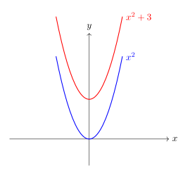
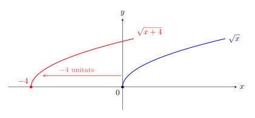
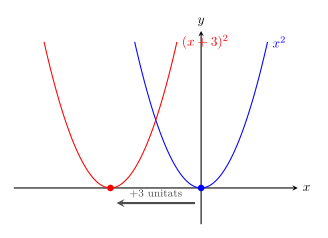
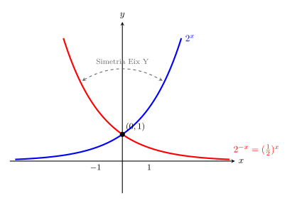
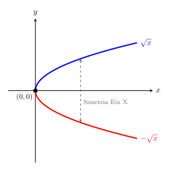
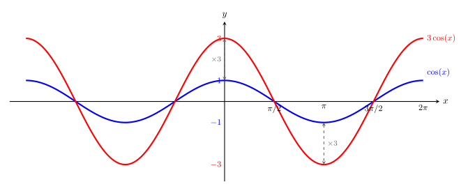
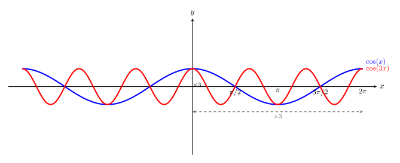
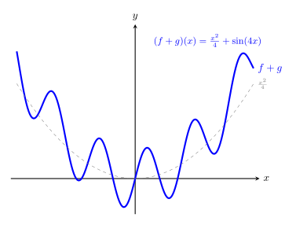
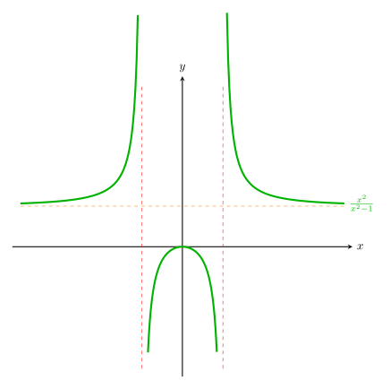

# Transformacions de funcions

Un cop fet l'estudi de les funcions elementals, on hem vist la seva expressió analítica, el seu domini i la seva gràfica, és hora d'obtenir noves funcions. En aquest apartat veurem unes transformacions que no modifiquen el seu comportament ni la "forma", però que ja ens permeten moure les funcions elementals pel pla cartesià, així com estirar-les o comprimir-les.

De fet, veurem que l'estudi de les funcions transformades és molt senzill si coneixem les propietats de les elementals. Aquestes modificacions es divideixen en dues categories geomètriques:

1. **Isometries:** Moviments que conserven la forma i mida. Poden ser **translacions** i **simetries**.
2. **Homotècies:** Canvis d'escala que deformen la funció verticalment o horitzontalment (estiraments i compressions).

---

## 1. Translació vertical: $f(x) \pm k$
Aquesta transformació és una **isometria**. Sumar o restar un valor constant $k$ al final de l'expressió de la funció desplaça tota la gràfica cap amunt o cap avall.

* **$f(x) + k$**: Desplaçament vertical cap amunt.
* **$f(x) - k$**: Desplaçament vertical cap avall.

> **Exemple:** Si partim de la paràbola elemental $f(x) = x^2$, la funció $g(x) = x^2 + 3$ representa la mateixa paràbola però amb el vèrtex situat en el punt $(0, 3)$ en lloc de l'origen.
> {width=60%}

---

## 2. Translació horitzontal: $f(x \pm k)$
És una **isometria** que afecta directament a la variable independent $x$. A diferència de la vertical, el sentit del desplaçament és invers al signe:

* **$f(x - k)$**: Desplaçament cap a la **dreta** $k$ unitats.
* **$f(x + k)$**: Desplaçament cap a l'**esquerra** $k$ unitats.

> **Exemple:** Per a la funció $f(x) = \sqrt{x}$, si creem $g(x) = \sqrt{x + 4}$, la gràfica "comença" 4 unitats a l'esquerra, en el punt $x = -4$.
> {width=80%}

---

> **Exemple:** Vegem la diferència respecte de l'exemple de la transformació vertical amb $f(x)=x^2$ i $g(x) = (x+3)^2$
>{width=60%}

---

## 3. Simetries: $-f(x)$ i $f(-x)$
Aquestes **isometries** actuen com un mirall respecte als eixos de coordenades.

* **$-f(x)$**: Simetria respecte a l'**eix X**. Els valors de les $y$ canvien de signe (la funció gira verticalment).
* **$f(-x)$**: Simetria respecte a l'**eix Y**. Els valors de les $x$ canvien de signe (la funció gira horitzontalment).

> **Exemple:** La funció exponencial $f(x) = 2^x$ és creixent. La seva simetria $f(-x) = 2^{-x}$ (que és el mateix que $(1/2)^x$) és exactament la mateixa corba però decreixent, reflectida respecte a l'eix vertical.
> 
> Observem que precisament obtenim la gràfica del cas en què la base de la funció exponencial té base $0<x<1$
> {width=80%}

---

> **Exemple**: Simetria de $f(x)=\sqrt{x}$ respecte de l'eix $OX$: $g(x)=-\sqrt{x}$
> {width=60%}

---

## 4. Estiraments i compressions verticals: $k \cdot f(x)$
Aquesta transformació és una **homotècia vertical**. En multiplicar tota la funció per un factor $k$, canviem la seva "amplitud":

* **Si $k > 1$**: La funció s'estira verticalment (creix o decreix més ràpidament).
* **Si $0 < k < 1$**: La funció es comprimeix verticalment (s'aplana cap a l'eix X).

> **Exemple:** Si mirem la funció trigonomètrica $f(x) = \cos(x)$, la funció $g(x) = 3\cos(x)$ tindrà màxims tres vegades més alts ($y=3$) i mínims tres vegades més baixos ($y=-3$) que l'original.
> {width=80%}

---

## 5. Estiraments i compressions horitzontals: $f(k \cdot x)$
Aquesta transformació és una **homotècia horitzontal**. En multiplicar $x$ per un factor $k$, la funció s'estira o es comprimeix d'una manera que pot semblar, d'entrada, poc intuïtiva:

* **Si $k > 1$**: La funció es comprimeix horitzontalment (en multiplicar l'$x$ abans que la funció actuï, queda tot "accelerat" i en el cas de les funcions periòdiques augmenta la freqüència). 
* **Si $0 < k < 1$**: La funció s'estira horitzontalment (podem pensar que en multiplicar $x$ per un factor entre 0 i 1, la funció es fa més "lenta").

> **Exemple:** Si mirem la funció trigonomètrica $f(x) = \cos(x)$, la funció $g(x) = \cos(3x)$ farà 3 períodes sencers en el temps que la funció original en fa només una.
> {width=100%}

---

## 6. Operacions amb funcions

A més de transformar una única funció, podem combinar dues funcions diferents ($f(x)$ i $g(x)$) per crear-ne una de nova mitjançant les operacions aritmètiques elementals. El resultat és una nova funció que relaciona les imatges de les originals per a cada valor de $x$.

Per als següents exemples, farem servir aquestes dues funcions polinòmiques senzilles:

* $f(x) = x^2 - 1$
* $g(x) = x - 1$

### 6.1. **Suma i resta**

La suma o resta de dues funcions és la suma o resta de les seves expressions analítiques punt a punt.

* $(f + g)(x) = f(x) + g(x) = (x^2 - 1) + (x - 1) = \mathbf{x^2 + x - 2}$
*  $(f - g)(x) = f(x) - g(x) = (x^2 - 1) - (x - 1) = \mathbf{x^2 - x}$

### 6.2. **Producte (Multiplicació)**
El producte de dues funcions s'obté multiplicant les seves expressions. Sovint caldrà aplicar la propietat distributiva o identitats notables per simplificar l'expressió final.

*  $(f \cdot g)(x) = f(x)\cdot g(x)=(x^2 - 1) \cdot (x - 1) = x^3 - x^2 - x + 1$

### 6.3. **Quocient (Divisió)**
La divisió de dues funcions genera una funció racional. Si sabem factoritzar, podem simplificar l'expressió resultant.

*  $\displaystyle \left(\frac{f}{g}\right)(x) = \frac{f(x)}{g(x)}=\frac{x^2 - 1}{x - 1} = \frac{(x-1)(x+1)}{x-1} = \mathbf{x + 1}$

---

### 6.4. **El Domini de les operacions amb funcions**
Aquest és el punt més important: la nova funció només existeix en aquells valors de $x$ on existeixen les dues funcions originals alhora.

1.  **Suma, Resta i Producte:** El domini és la **intersecció** dels dominis originals.
   
    $$Dom(f \pm g) = Dom(f) \cap Dom(g)$$

    $$Dom(f \cdot g) = Dom(f) \cap Dom(g)$$

2.  **Quocient:** El domini és la intersecció dels dominis originals **excloent** els valors que fan que el denominador sigui zero.
   
    $$Dom\left(\frac{f}{g}\right) = \{x \in Dom(f) \cap Dom(g) \mid g(x) \neq 0\}$$

>**Exemple** En el quocient d'abans $\frac{x^2-1}{x-1}$, tot i que la solució simplificada és la recta $x+1$, el valor **$x=1$ no pertany al domini** perquè la funció $g(x)$ original s'anul·laria (divisió per zero). O sigui:

>$$Dom\left(\frac{f}{g}\right) = \{x \in \mathbf{R} \mid x=1\}$$

---

> **Exemples gràfics**
>
> Vegem quin aspecte, des del punt de vista gràfic, podem tenir les funcions resultants d'una suma i un quocient obtingudes a partir de funcions senzilles.
> 
> Considerem les funcions $f(x)=\displaystyle\frac{x^2}{4}$ i $g(x)=\sin(4x)$. La gràfica de $(f+g)(x)$ és:
>
> {width=60%}
>
> Observeu l'efecte de la paràbola,$f(x)$, que marca la tendència de la gràfica i l'efecte del sinus, $g(x)$, que provoca l'oscil·lació.

---

>Considerem ara les funcions $f(x)=x^2$ i $g(x)=x^2-1$. La gràfica de $\left ( \displaystyle\frac{f}{g} \right) (x)=\displaystyle\frac{x^2}{x^2-1}$ és:
>
> {width=60%}
>
> Observeu que el quocient ens fa aparèixer dos zeros al denominador ($x=1$ i $x=-1$) que no pertanyen al domini i fan aparèixer dues asímptotes verticals.