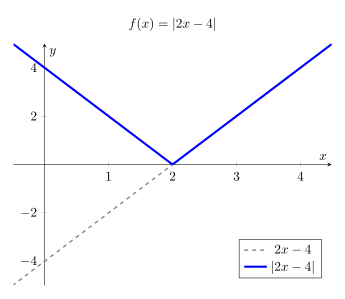
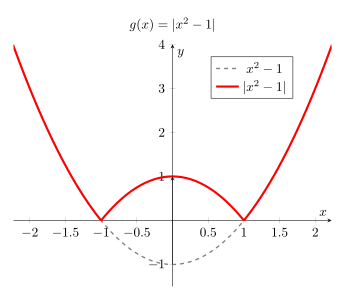

# Expressió analítica de funcions en valor absolut

L'objectiu d'aquest apartat és aprendre a escriure una funció en valor absolut com una **funció definida a trossos**. Això és essencial per poder operar, derivar o representar la funció amb facilitat.

## 1. Recordant el concepte de valor absolut

El valor absolut d'una funció, $|f(x)|$, ens indica que el resultat final ha de ser sempre positiu o zero. 

Podem veure com funciona si avaluem una funció com $f(x) = |x - 5|$ en diferents punts:

* **Si $x = 8$**: $f(8) = |8 - 5| = |3|=3$. Com que el resultat, sense valor absolut, és positiu, el deixem igual.
* **Si $x = 5$**: $f(5) = |5 - 5| = |0|=0$.
* **Si $x = 2$**: $f(2) = |2 - 5| = |-3|=3$. Com que el resultat, sense valor absolut, és negatiu, el valor absolut el fa positiu: $-(-3) = \mathbf{3}$.

Per tant, el valor absolut actua com un **operador condicional**:

1. Si per a un determinat $x_0$ tenim que $f(x_0)\geq 0$ tindrem que $|f(x_0)|=f(x_0)$.
2. En canvi, si per a un determinat $x_0$ tenim que $f(x_0)<0$, llavors $|f(x_0)|=-f(x_0)$. Observem com el fet de multiplicar per $-1$ fa que un valor negatiu es transformi en positiu.

---

## 2. Interpretació geomètrica: La simetria respecte l'eix OX

Ja hem estudiat que en fer $-f(x)$ obtenim una funció simètrica respecte a l'eix $OX$. En el cas d'una funció en valor absolut, el que farem serà aplicar el canvi $-f(x)$ només en els casos en què la funció prengui valors negatius. Per representar gràficament una funció $|f(x)|$, dibuixarem la gràfica de $f(x)$ i farem una simetria respecte de $OX$ de tots els intervals que estiguin per sota de zero.

---

## 3. Instruccions per obtenir la funció definida a trossos

Queda clar, doncs, que l'única dificultat per escriure la funció definida a trossos d'una funció en valor absolut, és determinar els **intervals** en què la funció és negativa o positiva.

Tot i que aquest procediment ja l'hem vist a l'apartat de [càlcul de dominis](../02_eines_calcul_dominis#2-resolucio-dinequacions-polinomiques), vegem-ho un cop més.

Per determinar els trossos d'una funció $|f(x)|$, seguirem aquests tres passos:

1.  **Trobar els zeros:** Resolem l'equació $f(x) = 0$. Aquests punts divideixen la recta real en diferents intervals.
2.  **Estudiar el signe a cada interval:** Utilitzarem una taula per determinar si la funció original és positiva o negativa en cada tram o interval.
3.  **Definir la funció a trossos:** Escriurem l'expressió final aplicant el canvi de signe només on la funció era negativa.

---

## 4. Exemples resolts

> **Exemple 1:** Funció afí
> 
> Escriure a trossos la funció: $f(x) = |2x - 4|$
>
> * **Zeros:** $2x - 4 = 0 \implies x = 2$.
> * **Taula d'intervals i signes:**
>
>| Interval | Punt de prova | $f(x) = 2x - 4$ | Signe | Conclusió  |
>| :--- | :--- | :--- | :--- | :--- |
>| $(-\infty, 2)$ | $x = 0$ | $-4$ | **$-$** | Canviem signe: $-(2x-4)$ |
>| $(2, +\infty)$ | $x = 3$ | $2$ | **$+$** | Deixem igual: $2x-4$ |
>
> * **Expressió definida a trossos:**
>
> $$f(x) = \begin{cases} -2x + 4 & \text{si } x < 2 \\ 2x - 4 & \text{si } x \geq 2 \end{cases}$$
>
> * **Gràfica:**
> 
{width=70%}

---

> **Exemple 2:** Funció quadràtica
> 
> Escriure a trossos la funció: $g(x) = |x^2 - 1|$
>
> * **Zeros:** $x^2 - 1 = 0 \implies x = \pm 1$.
> * **Taula d'intervals i signes:**
>
> | Interval | Punt de prova | $g(x) = x^2 - 1$ | Signe | Conclusió  |
| :--- | :--- | :--- | :--- | :--- |
| $(-\infty, -1)$ | $x = -2$ | $3$ | **$+$** | Deixem igual: $x^2-1$ |
| $(-1, 1)$ | $x = 0$ | $-1$ | **$-$** | Canviem signe: $-x^2+1$ |
| $(1, +\infty)$ | $x = 2$ | $3$ | **$+$** | Deixem igual: $x^2-1$ |
>
> * **Expressió definida a trossos:**
>
> $$g(x) = \begin{cases} x^2 - 1 & \text{si } x < -1 \\ -x^2 + 1 & \text{si } -1 \leq x < 1 \\ x^2 - 1 & \text{si } x \geq 1 \end{cases}$$
>
> * **Gràfica:**
> 
>{width=70%}