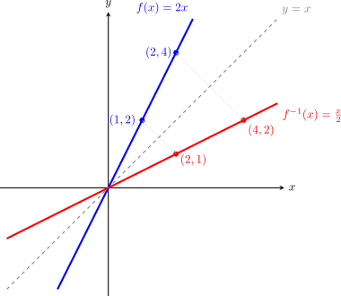

# Composició de funcions i funció inversa

La composició és una nova operació que permet construir funcions complexes a partir de funcions més senzilles. A diferència de les operacions aritmètiques, aquí no sumem ni multipliquem valors, sinó que **apliquem una funció sobre el resultat d'una altra**.

## 1. El concepte de cadena
Podem imaginar la composició com una cadena de muntatge: el valor $x$ entra en la primera funció, aquesta genera un resultat, i aquest resultat s'introdueix immediatament com a dada d'entrada en la segona funció. Esquemàticament, si $f(x)$ la volem compondre amb $g(x)$:

$$x \xrightarrow{f} f(x) \xrightarrow{g} g(f(x))$$

> **Exemple**
> Composem $f(x)=x^2$ amb $g(x)=x-1$ i mirem la imatge per a $x=2$:
>
> $$2 \xrightarrow{x^2} 4 \xrightarrow{x-1} 3$$
>
>Com podem observar, apliquem les funcions "en cadena", o sigui una darrere de l'altra i prenent el resultat d'una com a entrada de l'altra. 

**Notació matemàtica:**

Matemàticament utilitzem la notació $(g \circ f)(x)$ per indicar a la composició i es llegeix com "**f composta amb g**" (sempre de dreta a esquerra, ja que $f$ és la primera a actuar):

$$(g \circ f)(x) = g(f(x))$$

## 2. Propietat: la no commutativitat
És important tenir en compte que l'ordre de l'operació canvia el resultat. O sigui, la composició no és commutativa. En general:

$$(g \circ f)(x) \neq (f \circ g)(x)$$

>**Exemple:**

>Siguin $f(x) = x^2$ i $g(x) = x + 5$.

> * $(g \circ f)(x) = g(f(x)) = g(x^2) = \mathbf{x^2 + 5}$
> * $(f \circ g)(x) = f(g(x)) = f(x+5) = \mathbf{(x+5)^2}=\mathbf{x^2+10x+25}$
> 
> Com es pot veure, els resultats són expressions totalment diferents.

---

## 3. Funció Inversa o Recíproca

Diem que una funció $f^{-1}$ és la inversa de $f$ si és capaç de "desfer" el camí fet per la primera. Si una funció porta el valor $A$ al valor $B$, la inversa portarà el valor $B$ de tornada al valor $A$.

## 4. Definició i Simetria
Dues funcions són inverses si en compondre-les obtenim la **funció identitat** $I(x) = x$. En aquest cas particular, la composició **sí que és commutativa**:

$$(f \circ f^{-1})(x) = x \quad \text{i} \quad (f^{-1} \circ f)(x) = x$$

> **Exemple:**
>
> Considerem $f(x)=2x$ i $g(x)=\displaystyle\frac{x}{2}$
>
> $$3 \xrightarrow{2x} 6 \xrightarrow{\frac{x}{2}} 3$$
>
> $$x \xrightarrow{2x} 2x \xrightarrow{\frac{x}{2}} x$$
>
>Com podem observar, una funció desfà el que fa l'altra

**Propietat gràfica:** Les gràfiques de $f$ i $f^{-1}$ són sempre simètriques respecte a la recta **$y = x$** (la bisectriu del primer i tercer quadrant).

> **Exemple:**
> 
> Si mirem les gràfiques de $f(x)=2x$ i $g(x)=\displaystyle\frac{x}{2}$ respecte de $y=x$:
> 
> 
{width=50%}

## 5. Mètode per trobar la funció inversa
Per calcular l'expressió de $f^{-1}(x)$ a partir de $f(x)$, seguim aquests passos:

1.  **Canvi de notació:** Escrivim $y$ en lloc de $f(x)$.
2.  **Intercanvi de variables:** Allà on hi ha una $x$ posem una $y$, i on hi ha una $y$ posem una $x$.
3.  **Aïllar la $y$** i la nova expressió obtinguda serà $f^{-1}(x)$.

>**Exemple de càlcul:**

>Trobem la inversa de $\displaystyle f(x) = \frac{3x - 5}{2}$:

>1.  $y = \displaystyle\frac{3x - 5}{2}$
>2.  $x = \displaystyle\frac{3y - 5}{2}$
>3.  Aïllem la $y$:
    * $2x = 3y - 5$
    * $2x + 5 = 3y$
    * $y = \displaystyle\frac{2x + 5}{3} \implies \mathbf{f^{-1}(x) = \frac{2x + 5}{3}}$