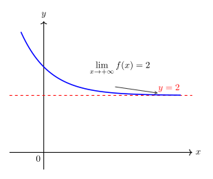
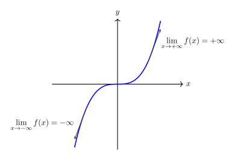
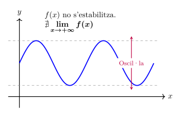
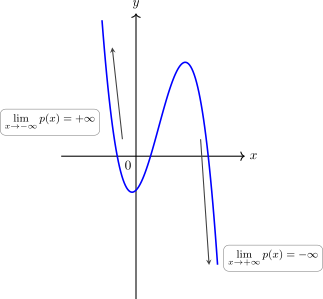
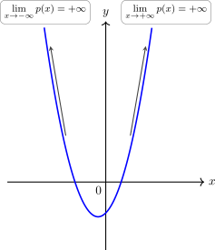
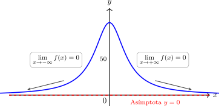
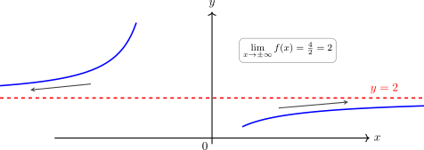
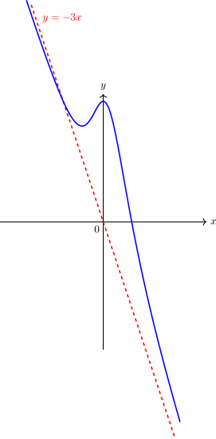

# Límits de funcions a l'infinit

 
Considerem la següent qüestió:   

Quina és la tendència de la imatge d'una funció ($y=f(x)$) quan la variable independent ($x$) es fa extremadament gran ($x \to +\infty$) o extremadament petita ($x \to -\infty$)?

El concepte de **límit a l'infinit** i el seu estudi serveix per descriure el **comportament a llarg termini** d'una funció i dona resposta a la pregunta plantejada. 

---

## 1. Concepte de tendència i límit a infinit

No totes les funcions es comporten igual quan ens allunyem infinitament de l'origen. Els tres casos de comportament a l'infinit són:

1. **Convergència:** La funció s'estabilitza al voltant d'un valor real $L$. Això indica la presència d'una **Asímptota Horitzontal** ($\mathbf{y=L}$). O sigui, la funció tendeix a apropar-se a una recta horitzontal a mesura que la $x$ creix o decreix.
Per indicar aquesta situació utilitzem la notació: 
   
$$\lim\limits_{x \to \pm\infty} f(x) = L$$

>**Exemple gràfic:** aquesta funció s'apropa al valor $y=2$ quan $x \to +\infty$

>{width=50%}

1. **Divergència:** La funció creix o decreix indefinidament ($\pm\infty$). Per indicar aquesta situació utilitzem la notació: 

$$\lim\limits_{x \to \pm\infty} f(x) = \pm\infty$$

>**Exemple gràfic:** aquesta funció creix o decreix indefinidament quan $x \to \pm\infty$

>{width=60%}

1. **Oscil·lació:** La funció no té un límit definit perquè els seus valors fluctuen sense estabilitzar-se en un valor ni marxar cap a  $\pm\infty$ (com les funcions trigonomètriques). Per indicar aquesta situació utilitzem la notació: 
   
$$\nexists \lim\limits_{x \to \pm\infty} f(x)$$

>**Exemple gràfic:** aquesta funció oscil·la permanentment i no convergeix cap a cap nombre ni divergeix cap a infinit.

>{width=50%}

---

>**Exemples:**

>| Funció | Tipus | Límit ($x \to \infty$) | Raonament numèric |
>| :---- | :---- | :---- | :---- |
>| $f(x) = \frac{1}{x}$ | Inversa | $0$ | Dividir 1 entre un nombre molt gran ens acosta a 0. |
>| $f(x) = x^2$ | Polinòmica | $+\infty$ | El quadrat d'un nombre gran és encara més gran. |
>| $f(x) = \sin(x)$ | Trigonomètrica | $\nexists$ | El valor sempre oscil·la entre $-1$ i $1$. |

---

## 2. Límits de funcions polinòmiques

En un polinomi, quan la $x$ és molt gran, el terme que té el grau més alt (el terme principal) creix tan ràpidament que la resta de termes es tornen insignificants. Per tant, el límit del polinomi és el mateix que el límit del seu terme de major grau i val $\pm\infty$:   
  
Si  $p(x)=a_nx^n+a_{n-1}x^{n-1}+...+a_1x+a_0$, llavors

$$\lim\limits_{x \to \pm\infty}p(x)=\lim\limits_{x \to \pm\infty} a_nx^n=a_n\cdot (\pm\infty)^n=\mathbf{{\pm\infty}}$$

Observem que, tot i que el resultat sempre serà infinit, caldrà **determinar-ne el signe**. Això, com podem veure, dependrà de dos elements:

* El **signe** de $a_n$
* En el cas $x \to -\infty$ de si l'exponent $n$ és **parell** o **senar**

### El control del signe quan $x \to +\infty$
Aquest cas és més senzill, ja que independentment de $n$, tenim que $(+\infty)^n=+\infty$. Per tant el signe final depen exclusivament del signe de $a_n$

>**Exemple 1:**

> Si $p(x)=3x^2+5x-2$, llavors $\lim\limits_{x \to +\infty} p(x)=\lim\limits_{x \to +\infty} 3x^2=3\cdot (+\infty)^2=+\infty$, ja que $3$ és positiu.
> 
--- 
> **Exemple 2:**
> 
> Si $p(x)=-2x^3+4x^2+x-1$, llavors $\lim\limits_{x \to +\infty} p(x)=\lim\limits_{x \to +\infty} -2x^3=-2\cdot (+\infty)^3=-\infty$, ja que $-2$ és negatiu.
> 
>{width=50%}

### El control del signe quan $x \to -\infty$
En aquest cas cal tenir més elements en compte: a banda del coeficient $a_n$, cal mirar si l'exponent $n$ és parell o senar, ja que:

* $(-\infty)^{\text{parell}} \to +\infty$
* $(-\infty)^{\text{senar}} \to -\infty$

Tenin en compte l'exponent $n$, el signe de $a_n$ i aplicant la regla dels signes, determinem el signe resultant. 

> **Exemple 1:**
> 
> * Si $p(x)=-4x^3+x-2$, llavors $\lim\limits_{x \to -\infty} p(x)=\lim\limits_{x \to -\infty} -4x^3=-4\cdot (-\infty)^3=-4 \cdot (-\infty)=+\infty$, ja que $-4$ és negatiu i al multiplicar per algo negatiu, queda un resultat positiu.

---

>**Exemple 2:**
>
> * Si $p(x)=2x^2+x-1$, llavors $\lim\limits_{x \to -\infty} p(x)=\lim\limits_{x \to -\infty} 2x^2=2\cdot (-\infty)^2=2 \cdot (+\infty)=+\infty$, ja que $2$ és positiu i al multiplicar positiu per positiu, ens queda positiu.  
>  
> 
>{width=50%}

---

## 3. Límits de funcions de la forma $\displaystyle\frac{k}{p(x)}$

Abans d'analitzar funcions racionals, cal entendre que si dividim un nombre constant $k$ per un polinomi que es fa infinit ($\pm\infty$), el resultat sempre tendeix a **zero**.

> **Exemple numèric: $f(x) = \displaystyle\frac{100}{x^2 + 1}$**
>
> | $x$ | $10$ | $100$ | $1.000$ | Tendència |
> | :--- | :--- | :--- | :--- | :--- |
> | $x^2+1$ | $101$ | $10.001$ | $1.000 .001$ | $\to +\infty$ |
> | $f(x)$ | $0,9901$ | $0,0099$ | $0,000099$ | **$\to 0$** |
> 
> Si ho escrivim en notació de límits tenim que $\lim\limits_{x \to \pm\infty} \displaystyle\frac{100}{x^2 + 1}=\frac{100}{+\infty}=0$
> 
> Vegem-ho gràficament:    
> 
>{width=60%}

En aquests casos, sempre obtenim una **asímptota horitzontal** $y=0$ quan $x \to \pm\infty$.

---

## 4. Límits de funcions racionals $\frac{p(x)}{q(x)}$

Siguin $p(x)$ i $q(x)$ dos polinomis qualssevol de grau $n$ i $m$ repectivament:

$$p(x)=a_nx^n+a_{n-1}x^{n-1}+...+a_1x+a_0$$

$$q(x)=b_mx^m+b_{m-1}x^{m-1}+...+b_1x+b_0$$

Ja sabem que els límits quan  $x \to \pm\infty$ dels polinomis són $\pm\infty$. Per tant: 

$$\lim\limits_{x \to \pm\infty} \displaystyle\frac{p(x)}{q(x)}=\frac{\pm\infty}{\pm\infty}$$

Aquesta operació amb els infinits resulta ser una **indeterminació** que caldrà resoldre per determinar el límit. En el cas d'un quocient de polinomis, només ens caldrà comparar el grau del numerador ($n$) amb el del denominador ($m$).

**Cas A: Grau del denominador és major que el del numerador ($n < m$)** 

El denominador creix molt més ràpid i arrossega la funció cap al zero.

* **Límit:** Sempre és **0**.
* **Asímptota:** Hi ha una **Asímptota Horitzontal** en $y = 0$.

Veure que això és així no és molt complicat:  

Sigui $d=n-m$

$$\lim\limits_{x \to \pm\infty} \displaystyle\frac{p(x)}{q(x)}=\lim\limits_{x \to \pm\infty}\frac{a_nx^n}{b_mx^m}=\lim\limits_{x \to \pm\infty}\frac{a_n\cancel{x^n}}{b_mx^d}=\frac{a_n}{b_m}\frac{1}{(\pm\infty)^d}=0$$

**Cas B: Graus iguals ($n = m$)**  

Hi ha un equilibri. El límit és el quocient dels coeficients dels termes de major grau.

* **Límit:** Sempre és $\mathbf{\displaystyle\frac{a_n}{b_m}}$.
* **Asímptota:** Hi ha una **Asímptota Horitzontal** en $y = \displaystyle\frac{a_n}{b_m}$.

Veure que això és així no és molt complicat:  

$$\lim\limits_{x \to \pm\infty} \displaystyle\frac{p(x)}{q(x)}=\lim\limits_{x \to \pm\infty}\frac{a_nx^n}{b_nx^n}=\lim\limits_{x \to \pm\infty}\frac{a_n\cancel{x^n}}{b_n\cancel{x^n}}=\frac{a_n}{b_n}$$

> **Exemple: $f(x) = \frac{4x^2 - 1}{2x^2 + 5x}$**
>
> | $x$ | $10$ | $100$ | $1.000$ | Tendència |
> | :--- | :--- | :--- | :--- | :--- |
> | $f(x)$ | $1,596$ | $1,946$ | $1,994$ | **$\to 2$** ($4/2$) |
>
> * **Asímptota:** Existeix una **Asímptota Horitzontal** en la recta $y = 2$.
>
>Vegem-ho gràficament:  
>
>{width=70%}

**Cas C: Grau del numerador és major que el del denominador ($n > m$)** 

El numerador domina i la funció es dispara cap a l'infinit.

* **Límit:** El resultat és $\pm\infty$.
* **Càlcul del signe:** Cal analitzar el signe del numerador i del denominador per separat aplicant la regla dels signes.
* **Asímptota:** En el cas que la diferència de grau entre el numerador i denominador sigui 1 ($n=m+1$) apareix una **asímptota obliqua**.
  
Veure que això és així no és molt complicat:  

Sigui $d=n-m$ (observem que $d$ és positiu ja que $n>m$)

$$\lim\limits_{x \to \pm\infty} \displaystyle\frac{p(x)}{q(x)}=\lim\limits_{x \to \pm\infty}\frac{a_nx^n}{b_mx^m}=\lim\limits_{x \to \pm\infty}\frac{a_nx^d}{b_m\cancel{x^m}}=\frac{a_n}{b_m}\cdot (\pm\infty)^d=\pm\infty$$

El signe final dependrà del signe resultant de $(\pm\infty)^d$ i dels signes de $a_n$ i $b_m$.

> **Exemple de càlcul de signe a $-\infty$:**  
> 
> Calculem $\lim\limits_{x \to -\infty} \frac{-3x^3 + 5}{x^2 + 1}$
>
> 1. **Numerador:** El terme principal és $-3x^3$. Si $x\to -\infty$ tenim $-3 \cdot (-\infty)^3 = -3 \cdot (-\infty) = \mathbf{+\infty}$.
> 2. **Denominador:** El terme principal és $x^2$. Si $x\to -\infty$ tenim $(-\infty)^2 = \mathbf{+\infty}$.
> 3. **Signe resultant del quocient:** $\displaystyle\frac{+} {+} = \mathbf{+\infty}$.
>
> Vegem-ho gràficament (a banda del límit a $-\infty$, també podem observar l'asímptota obliqua):  
>
> {width=40%}

---

## 5. Resum d'Asímptotes

Diem que una funció té una **Asímptota Horitzontal** en la recta $y = L$ si es compleix que el seu límit a l'infinit és un nombre real:

$$\lim_{x \to \infty} f(x) = L \quad \text{o} \quad \lim_{x \to -\infty} f(x) = L$$

Aquesta línia representa l'estabilització de la funció quan ens allunyem cap als extrems esquerre o dret del gràfic. En el cas de quocient de polinomis, es correspon als **casos A i B** que hem vist.

Diem que una funció té una **Asímptota Obliqua** en la recta $y=mx+n$ (amb $m\ne 0$) si $\lim\limits_{x \to \pm\infty} f(x) = \pm\infty$ i la gràfica de la funció tendeix a apropar-se a aquesta recta quan $x\to \pm\infty$. En el cas de les funcions racionals això passa en el **cas C quan** $\mathbf{n=m+1}$ (o sigui, el grau del numerador és una unitat més que el grau del denominador). El valor de $m$ i $n$ és:

$$m=\lim\limits_{x \to +\infty} \displaystyle\frac{f(x)}{x}$$

$$n=\lim\limits_{x \to +\infty} \left(f(x)-mx
\right)$$