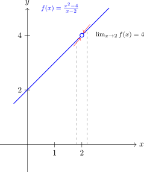
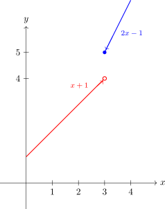
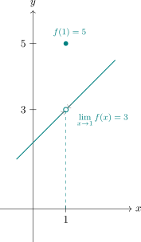
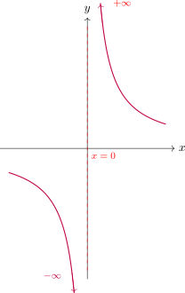

# Límits en un punt

Calcular el valor d'una funció en un punt concret, substituint la $x$ pel valor desitjat, ens dona una informació útil i molt concreta, no obstant això, alguns cops no podem calcular la imatge en un punt determinat (per exemple, quan obtenim una divisió per zero). També existeixen funcions on es produeixen salts en algun punt que trenquen la continuïtat de la gràfica i, en aquests casos, el valor de la funció en el punt de ruptura no ens explica el que està passant en el seu entorn...    
Els **límits** ens ajuden a resoldre aquests conflictes: ens permeten estudiar què li passa a la funció **al voltant** d'aquest punt conflictiu. Gràcies a aquesta eina, podrem analitzar el comportament de la funció i, més endavant, podrem classificar amb precisió els diferents tipus de **discontinuïtats**.

## 1. Idea intuïtiva de límit

L'objectiu dels límits en un punt és estudiar el comportament de la imatge d'una funció $y=f(x)$ quan la variable $x$ es mou molt a prop d'un valor concret $a$. 

És fonamental tenir en compte tres aspectes clau:

* Ens interessa saber com es comporten les imatges de la funció, $y=f(x)$, quan la $x$ s'apropa al punt $a$ ($x \to a$).
* **No importa el que valgui la funció exactament en el punt $x=a$**. De fet, $f(a)$ podria no existir ($a \notin Dom(f)$).
* El que sí que és necessari és que els punts propers a $x=a$ (el seu entorn) pertanyin al domini de la funció.

> **Exemple:**
> 
Considerem la funció $f(x) =\displaystyle\frac{x^2 - 4}{x - 2}$. Si intentem calcular $f(2)$, obtenim $\displaystyle\frac{0}{0}$. De fet, $x=2$, no és del domini de $f(x)$ ja que anul·la el denominador. En canvi, els punts propers a $x=2$ sí que són del domini. Què passa si ens **acostem molt** a $x=2$? Vegem-ho amb una taula de valors.
>
>**Taula de valors al voltant de $x=2$:**

>| $\to 2$ per l'esquerra | $x$ | $f(x)$ | $2 \gets$ per la dreta | $x$ | $f(x)$ |
| :--- | :--- | :--- | :--- | :--- | :--- |
| A prop| $1,9$ | $3,9$ | Més lluny | $2,1$ | $4,1$ |
| Més a prop | $1,99$ | $3,99$ | Més a prop | $2,01$ | $4,01$ |
| Molt a prop | $1,999$ | $3,999$ | Molt a prop | $2,001$ | $4,001$ |
| Molt més a prop | $1,9999$ | $3,9999$ | Molt més a prop | $2,0001$ | $4,0001$ |

>Observem que, tot i que la funció no està definida en el punt $x=2$, els valors de la $y$ s'apropen (convergeixen) clarament cap a **4**. Diem que el límit de la funció quan $x$ tendeix a 2 és 4. I ho escrivim:

>$$\lim\limits_{x \to 2} f(x)=4$$

>Gràficament:

>{width=40%}

---

## 2. Límits laterals

En l'exemple anterior, hem vist que a un punt de la recta real ens hi podem apropar des de dues direccions (per la dreta o per l'esquerra del nombre). Definim els límits laterals:

* **Límit per l'esquerra:** $\lim\limits_{x \to a^-} f(x)$ (ens acostem amb valors $x < a$).
* **Límit per la dreta:** $\lim\limits_{x \to a^+} f(x)$ (ens acostem amb valors $x > a$).

>**Exemple: funció definida a trossos**

>En les funcions definides a trossos, és molt comú que els límits laterals no coincideixin en els punts de trencament o ruptura.

>$$f(x) = \begin{cases} x + 1 & \text{si } x < 3 \\ 2x - 1 & \text{si } x \ge 3 \end{cases}$$

>Analitzem què passa quan ens acostem al punt $x=3$

>**Aproximació per l'esquerra ($x \to 3^-$)**

>Utilitzem el tram $f(x) = x + 1$, ja que val per a valors de $x$ menors que 3.

>| $x$ (per l'esquerra) | operació: $x + 1$ | $f(x)$ |
| :--- | :--- | :--- |
| $2,9$ | $2,9 + 1$ | $3,9$ |
| $2,99$ | $2,99 + 1$ | $3,99$ |
| $2,999$ | $2,999 + 1$ | $3,999$ |
| **Tendència** | $\to 3 + 1$ | **$\to 4$** |

>**Aproximació per la dreta ($x \to 3^+$)**

>Utilitzem el tram $f(x) = 2x - 1$, ja que val per a valors de $x$ majors o iguals a 3.

>| $x$ (per la dreta) | operació: $2x - 1$ | $f(x)$ |
| :--- | :--- | :--- |
| $3,1$ | $2(3,1) - 1$ | $5,2$ |
| $3,01$ | $2(3,01) - 1$ | $5,02$ |
| $3,001$ | $2(3,001) - 1$ | $5,002$ |
| **Tendència** | $\to 2(3) - 1$ | **$\to 5$** |

>En aquest cas, com que sí que podem avaluar $x=3$ en les funcions de cada tram de la definició a trossos, calcular els límits laterals és molt senzill:

>* **Per l'esquerra ($x \to 3^-$):** Substituïm en el primer tram: $3 + 1 = \mathbf{4}$. Per tant: 

>$$\lim\limits_{x \to 3^-} f(x)=4$$

>* **Per la dreta ($x \to 3^+$):** Substituïm en el segon tram: $2(3) - 1 = \mathbf{5}$.

>$$\lim\limits_{x \to 3^+} f(x)=5$$

>Gràficament:

>{width=40%}

---

## 3. Existència i unicitat del límit

Perquè puguem dir que **existeix el límit d'una funció en un punt**, els dos **límits laterals** han d'existir i ser **iguals**:

$$\mathbf{\lim_{x \to a} f(x) = L \iff \lim_{x \to a^-} f(x) = \lim_{x \to a^+} f(x) = L}$$

En cas d'existir el límit en un punt, aquest és **únic**.

Si els límits laterals donen resultats diferents (com a l'exemple de la funció a trossos), diem que **el límit en aquest punt no existeix**.

> **Exemple: Funció amb punt desplaçat**

>En aquest cas, la funció està definida en tot $\mathbb{R}$, però el valor de la imatge en un punt concret "salta" fora de linia que segueix la gràfica (una recta). Estudiarem què passa quan ens acostem a $x = 1$.

>Definim la funció:

>$$f(x) = \begin{cases} x + 2 & \text{si } x \neq 1 \\ 5 & \text{si } x = 1 \end{cases}$$

> **Estudi numèric (taula de valors)**

>Observem què passa amb les imatges quan ens acostem molt al valor $x = 1$ des de l'esquerra i des de la dreta. Fixa't que, per a tots aquests punts, farem servir la fórmula $x + 2$ perquè cap d'ells és exactament $1$.

>| Aproximació per l'esquerra ($x \to 1^-$) | $f(x)$ | | Aproximació per la dreta ($x \to 1^+$) | $f(x)$ |
| :--- | :--- | :--- | :--- | :--- |
| $0,9$ | $2,9$ | | $1,1$ | $3,1$ |
| $0,99$ | $2,99$ | | $1,01$ | $3,01$ |
| $0,999$ | $2,999$ | | $1,001$ | $3,001$ |
| **Tendència** | **$\to 3$** | | **Tendència** | **$\to 3$** |

> **Càlcul dels límits laterals**

>Utilitzem la definició de cada tram per calcular-los analíticament:

>* **Límit per l'esquerra:** 

>$$\lim\limits_{x \to 1^-} f(x) = \lim\limits_{x \to 1^-} (x + 2) = 1 + 2 = \mathbf{3}$$

>* **Límit per la dreta:** 

>$$\lim\limits_{x \to 1^+} f(x) = \lim\limits_{x \to 1^+} (x + 2) = 1 + 2 = \mathbf{3}$$

>**Conclusió i existència del límit**

>En aquest cas, encara que sabem que la imatge real en el punt és $f(1) = 5$, els límits laterals coincideixen en un valor diferent:

>* Els límits laterals són iguals: $\lim\limits_{x \to 1^-} f(x) = \lim\limits_{x \to 1^+} f(x) = 3$.
>* Per tant, **el límit en el punt existeix** i és únic: 

> $$\lim\limits_{x \to 1} f(x) = 3$$

>* Observem que $\lim\limits_{x \to 1} f(x) \neq f(1)$, ja que $3 \neq 5$.

>Gràficament:

>{width=30%}

> **Nota important:** Aquest exemple demostra perfectament que el límit ens diu cap on es dirigeix la funció (la seva intenció), independentment d'on acabi estant el punt realment.

---

## 4. Límit infinit en un punt

De vegades, en apropar-nos a un punt, la funció creix o decreix indefinidament. Això indica la presència d'una **asímptota vertical** o una discontinuïtat de tipus asimptòtica. Vegem un exemple senzill al voltant del punt $x=0$.

>**Exemple:**
>Analitzem $f(x) = \displaystyle\frac{1}{x}$ prop de $x=0$ (que anul·la el denominador i, per tant, no pertany al domini):

>| $x$ (Esquerra) | $f(x)$ | | $x$ (Dreta) | $f(x)$ |
| :--- | :--- | :--- | :--- | :--- |
| $-0,01$ | $-100$ | | $0,01$ | $100$ |
| $-0,001$ | $-1000$ | | $0,001$ | $1000$ |
| $-0,0001$ | $-10000$ | | $0,0001$ | $10000$ |

>* $\lim\limits_{x \to 0^-} \displaystyle\frac{1}{x} = -\infty$ (com més ens apropem al zero per l'esquerra més petit és fa el nombre).
>* $\lim_\limits{x \to 0^+} \displaystyle\frac{1}{x} = +\infty$ (com més ens apropem al zero per la dreta més gran és fa el nombre).

> Obsereveu com indiquem que la funció es fa gran o petita indefinidament al voltant del zero: $\pm\infty$
>
> Gràficament:

>{width=40%}

