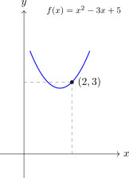

# Càlcul de límits en un punt

Gràcies al concepte de **continuïtat**, calcular el límit d'una funció en un punt és, en la majoria de casos, un procés algèbric directe. Com que sabem que les funcions elementals (polinòmiques, racionals, exponencials, etc.) són contínues en el seu domini, el valor del límit coincidirà amb el valor de la funció.

---

## 1. Càlcul de límits en punts del domini (sense ruptura)

Si el punt $x=a$ pertany al domini de la funció i no és un punt de ruptura en una funció a trossos, el límit es calcula simplement **avaluant la funció** en aquest punt.

> **Exemple 1: Funció polinòmica**
> 
> Calcula $\lim\limits_{x \to 2} (x^2 - 3x + 5)$  
> Com que és un polinomi, substituïm directament:
> 
> $$2^2 - 3(2) + 5 = 4 - 6 + 5 = \mathbf{3}$$
>
>Gràficament podem observar la continuïtat en $x=2$:  
>
>
>{width=40%}
>
> **Exemple 2: Funció racional en punt del domini**
> 
> Calcula $\lim\limits_{x \to 0} \frac{x + 4}{x - 2}$ 
>  
> Substituïm:
> 
> $$\frac{0 + 4}{0 - 2} = \frac{4}{-2} = \mathbf{-2}$$

---

## 2. Càlcul en punts de ruptura (funcions a trossos)

Si volem calcular el límit en el punt on una funció definida a trossos canvia de tram, estem obligats a calcular els **límits laterals**. Per fer-ho, avaluarem el punt $x=a$ en el tram que correspongui a cada costat.

> **Exemple: Punt de ruptura**
> 
> Sigui $f(x) = \begin{cases} 2x + 1 & \text{si } x < 1 \\ x^2 + 2 & \text{si } x \ge 1 \end{cases}$.  
>   
>Calcula $\lim\limits_{x \to 1} f(x)$:
>
> 1. **Límit per l'esquerra:** Utilitzem el primer tram ($x < 1$)
> 
>$$\lim_{x \to 1^-} (2x + 1) = 2(1) + 1 = \mathbf{3}$$
> 
> 2. **Límit per la dreta:** Utilitzem el segon tram ($x \ge 1$)
> 
>$$\lim_{x \to 1^+} (x^2 + 2) = 1^2 + 2 = \mathbf{3}$$
>
> **Conclusió:** Com que els laterals coincideixen, $\lim\limits_{x \to 1} f(x) = 3$. A més, com que $f(1)=3$, la funció és contínua en aquest punt.

---

## 3. Càlcul en punts que no són del domini

Quan avaluem un límit en un punt que no és del domini, solem trobar-nos amb una divisió per zero. Hem de distingir dos escenaris:

### Cas A: El numerador **no** s'anul·la $\left(\displaystyle\frac{k}{0}\right)$
  
Si en substituir obtenim un número real dividit per zero, el límit serà **infinit** ($\pm \infty$). Per saber el signe, hem de fer un estudi del signe per a valors propers a dreta i esquera. O sigui, ens cal calcular els **límits laterals**.

> **Exemple:**
> 
> Calcula $\lim\limits_{x \to 2} \displaystyle\frac{x + 1}{x - 2}$. En substituir obtenim $\displaystyle\frac{3}{0}$.  
>
> Sabem que el límit és infinit. Ens interessa, però el signe resultant. Per a això mirem com queda el signe del numerador i del denominador per a valors propers al $2$ a banda i banda del punt:

>* **Límit per l'esquerra:** Si prenem un valor com $1,99$, el denominador $(1,99 - 2)$ és un nombre negatiu molt petit.

>$$\lim\limits_{x \to 2^-} \frac{x + 1}{x - 2} = \frac{3}{0^-} = \mathbf{-\infty}$$
>
> * **Límit per la dreta:** Si prenem un valor com $2,01$, el denominador $(2,01 - 2)$ és un nombre positiu molt petit.
> 
>$$\lim\limits_{x \to 2^+} \frac{x + 1}{x - 2} = \frac{3}{0^+} = \mathbf{+\infty}$$

> **Conclusió:** No existeix el límit en el punt (discontinuïtat asimptòtica: **asímptota vertical en $\mathbf{x=2}$**).

### Cas B: Numerador i denominador s'anul·len $\left(\displaystyle\frac{0}{0}\right)$
En **funcions racionals** $\left(\displaystyle\frac{p(x)}{q(x)}\right)$, això indica que el numerador i el denominador comparteixen un factor comú. Per resoldre-ho: 

* Factoritzem
* Simplifiquem
* Tornem a avaluar

> **Exemple:**
> 
> Calcula $\displaystyle\lim\limits_{x \to 2} \frac{x^2 - 4}{x^2 - 2x}$. En substituir obtenim $\displaystyle\frac{0}{0}$.
>
> * **Factoritzem:**
> 
>$$x^2 - 4 = (x-2)(x+2)$$
> 
>$$x^2 - 2x = x(x-2)$$
> 
> * **Simplifiquem el factor $(x-2)$:**
> 
>$$\lim_{x \to 2} \frac{(x-2)(x+2)}{x(x-2)} = \lim_{x \to 2} \frac{x+2}{x}$$
> 
> * **Tornem a avaluar:**
> 
>$$\frac{2+2}{2} = \frac{4}{2} = \mathbf{2}$$
>
> **Conclusió:** El límit existeix i val 2 (discontinuïtat evitable).