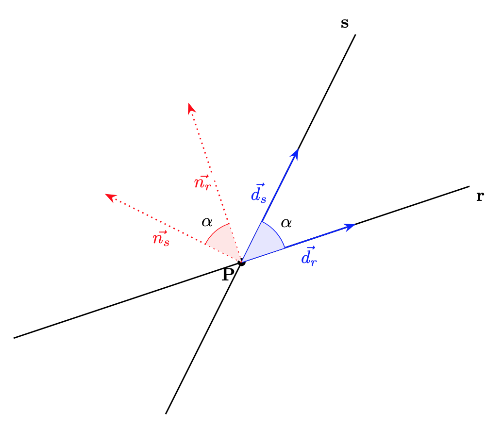
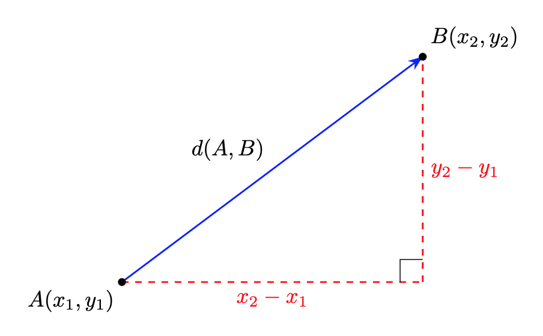
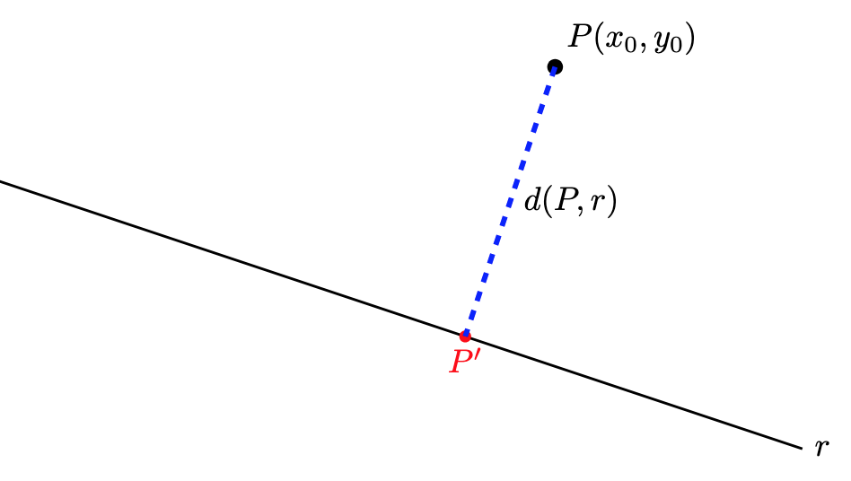

# Mètrica al pla

En aquest apartat estudiarem el càlcul de distàncies i angles entre els elements fonamentals del pla: els punts i les rectes.

## 1. Angle entre dues rectes

L'angle $\alpha$ que formen dues rectes $r$ i $s$ es defineix com l'angle més petit dels dos que determinen en tallar-se. Per tant, $0 \le \alpha \le 90^\circ$.

**A partir dels vectors directors o normals:** L'angle entre dues rectes és el mateix que l'angle entre els seus vectors directors (i també entre els seus vectors normals). Per tant, si $\vec{d_r}$ i $\vec{d_s}$ són els vectors directors (o $\vec{n_r}$ i $\vec{n_s}$ els vectors normals), a partir de la definició del producte escalar tenim:

$$\mathbf{\cos \alpha = \frac{|\vec{d_r} \cdot \vec{d_s}|}{|\vec{d_r}| \cdot |\vec{d_s}|}= \frac{|\vec{n_r} \cdot \vec{n_s}|}{|\vec{n_r}| \cdot |\vec{n_s}|}}$$

Observem la relació dels angles entre dues rectes, els seus vectors directors i els seus vectors normals:
{width=85%}

**A partir dels pendents:** Si coneixem els pendents $m_r$ i $m_s$ de les rectes:

$$\mathbf{\tan \alpha = \left| \frac{m_s - m_r}{1 + m_s \cdot m_r} \right|}$$

!!! example "Exemple: angle entre rectes"
    Troba l'angle que formen les rectes $\mathbf{r: 3x - 4y + 2 = 0}$ i $\mathbf{s: x + 2y - 5 = 0}$.

    * Vector normal de $\mathbf{r}$: $\vec{d_r} = (4, 3)$
    * Vector normal de $\mathbf{s}$: $\vec{d_s} = (-2, 1)$
    * Càlcul:
  
    $$\cos \alpha = \frac{|(4 \cdot (-2)) + (3 \cdot 1)|}{\sqrt{4^2 + 3^2} \cdot \sqrt{(-2)^2 + 1^2}} = \frac{|-8 +3|}{5 \cdot \sqrt{5}} = \frac{5}{5\sqrt{5}} = \frac{1}{\sqrt{5}}$$
    
    $$\alpha = \arccos\left(\frac{1}{\sqrt{5}}\right) \approx 63,43^\circ$$

## 2. Distància entre dos punts

La distància entre dos punts $A(x_1, y_1)$ i $B(x_2, y_2)$ coincideix amb el mòdul del vector $\overrightarrow{AB}$:

$$\overrightarrow{AB} = (x_2 - x_1,y_2 - y_1)$$

$$\mathbf{d(A, B) = |\overrightarrow{AB}| = \sqrt{(x_2 - x_1)^2 + (y_2 - y_1)^2}}$$

Observem gràficament que aquest càlcul és aplicar el teorema de pitàgores:

{width=80%}

!!! example "Exemple: Distància entre punts"
    Calcula la distància entre $A(-2, 3)$ i $B(4, -1)$:

    $$d(A, B) = \sqrt{(4 - (-2))^2 + (-1 - 3)^2} = \sqrt{6^2 + (-4)^2} = \sqrt{36 + 16} = \sqrt{52} \approx 7,21 \text{ u}$$

## 3. Distància d'un punt a una recta

La distància d'un punt $P(x_0, y_0)$ a una recta $r: Ax + By + C = 0$ és la longitud del segment perpendicular a la recta que va pel punt $P$ a la recta:

$$\mathbf{d(P, r) = \frac{|A \cdot x_0 + B \cdot y_0 + C|}{\sqrt{A^2 + B^2}}}$$

Observem gràficament el concepte de distància d'un punt $P$ a una recta $r$. Vegem també que, si calculem la intersecció, $P'$, de la recta perpendicular a $r$ que passa per $P$, el problema passa a ser un càlcul de distància entre dos punts ($d(P,r) = d(P,P')$):

{width=80%}

!!! example "Exemple: Distància punt-recta"
    Troba la distància del punt $P(5, 2)$ a la recta $r: 3x - 4y + 3 = 0$:

    $$d(P, r) = \frac{|3 \cdot 5 - 4 \cdot 2 + 3|}{\sqrt{3^2 + (-4)^2}} = \frac{|15 - 8 + 3|}{5} = \frac{10}{5} = 2 \text{ u}$$

## 4. Distància entre dues rectes

* Si les rectes són **secants** o **coincidents**, la distància és $0$.
* Si les rectes són **paral·leles** només cal prendre un punt qualsevol d'una de les rectes i calcular la distància punt-recta d'aquest punt a l'altra recta.    Alternativament, si les equacions de les rectes són de la forma, $r: Ax + By + C = 0$ i $s: Ax + By + C' = 0$, la distància és la diferència entre els seus termes independents normalitzada:

$$d(r, s) = \frac{|C' - C|}{\sqrt{A^2 + B^2}}$$

!!! example ""
    Considerem les rectes $r: x - 2y + 5 = 0$ i $s: 2x - 4y - 6 = 0$.
    
    **Mètode 1: Distància punt-recta**

    * Busquem un punt qualsevol de la recta $r$:  
    Si fem $x = -1$ en $r$:
       $-1 - 2y + 5 = 0 \implies -2y = -4 \implies y = 2$. Tenim el punt **$P(-1, 2)$**.

    * Calculem la distància de $P$ a la recta $s$:
  
    $$d(P, s) = \frac{|2(-1) - 4(2) - 6|}{\sqrt{2^2 + (-4)^2}} = \frac{|-16|}{\sqrt{20}} = \frac{16}{2\sqrt{5}} = \frac{8}{\sqrt{5}} \approx 3,58 \text{ u}$$
    
    **Mètode 2: Fórmula directa (normalitzant coeficients)**
    Primer igualem els coeficients $A$ i $B$. Dividim l'equació de $s$ per $2$:
    $s: x - 2y - 3 = 0$ (ara $A=1, B=-2, C'=-3$)
    
    Ara apliquem la fórmula $d(r, s) = \frac{|C' - C|}{\sqrt{A^2 + B^2}}$ amb $C=5$ i $C'=-3$:

    $$d(r, s) = \frac{|-3 - 5|}{\sqrt{1^2 + (-2)^2}} = \frac{|-8|}{\sqrt{5}} = \frac{8}{\sqrt{5}} \approx 3,58 \text{ u}$$