# GEOMETRIA ANALÍTICA

 

# **Els Vectors al Pla**

## 1. Necessitat de les magnituds vectorials
No totes les magnituds físiques es poden descriure completament amb un sol número (magnitud **escalar**, com la massa o la temperatura). N'hi ha d'altres que necessiten altra informació: la **direcció** i el **sentit**.

!!! Example "Exemples"
    * **Velocitat:** Dir que un avió vola a 800 km/h és insuficient; necessitem saber en quina **direcció** ho fa (per exemple, la línia Barcelona-París) i en quin **sentit** (cap al Nord o cap al Sud).
    * **Força (direcció):** Si empenys un objecte amb una força $\vec{F}$, el resultat serà diferent si empenys cap a la dreta (per moure'l) o cap avall (per aixafar-lo).
    * **Força (sentit):** Si vols obrir una porta, a banda del mòdul i la direcció de la força, cal un sentit. En un sentit s'obre i en l'altre es tanca.
---
## 2. Definició de vector
Geomètricament, un vector $\vec{v}$ es pot representar com un segment orientat (com una fletxa). Un vector es caracteritza per tenir:

* **Mòdul:** La longitud del segment. Es representa com $|\vec{v}|$.
* **Direcció:** La recta que conté el segment o qualsevol de les seves paral·leles.
* **Sentit:** Indicat per la punta de la fletxa.

!!! note "Gràficament podem observar les característiques d'un vector de la següent forma:"

    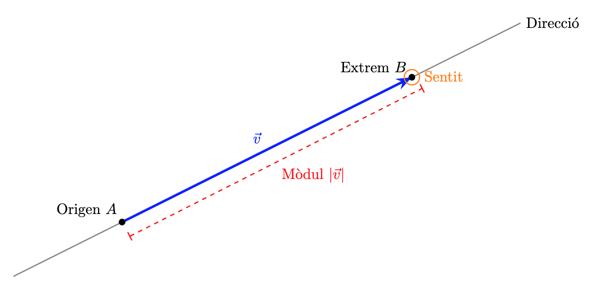

---

## 3. Operacions geomètriques amb vectors
* **Producte per un escalar:** El producte d'un número (un escalar) $k$ per un vector $\vec{u}$ és un nou vector $k \cdot \vec{u}$ amb la mateixa direcció. Si $k>0$, el sentit es manté, en canvi, si $k < 0$, el sentit s'inverteix. El mòdul del vector quedarà multiplicat per $k$:

$$|k \cdot \vec{u}|=k \cdot |\vec{u}|$$

* **Vector oposat:** El vector $-\vec{u}$ té el mateix mòdul i direcció que $\vec{u}$, però el sentit contrari. En definitiva, s'obté multiplicant $\vec{u}$ per $-1$

!!! note ""
    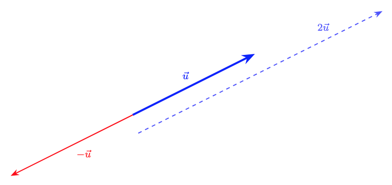

* **Suma de vectors:** Es defineix geomètricament col·locant l'origen de $\vec{v}$ a l'extrem de $\vec{u}$. El vector suma $\vec{u} + \vec{v}$ és el que va de l'origen de $\vec{u}$ a l'extrem de $\vec{v}$.

!!! note "En la representació següent observem la representació de la suma de dos vectors. A més, podem veure la commutativitat d'aquesta operació:"

    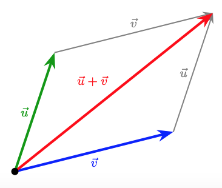

* **Resta de vectors:** La resta s'entén com la suma del primer amb l'oposat del segon:
    $\vec{u} - \vec{v} = \vec{u} + (-\vec{v})$

!!! note "En la representació següent observem la representació de la resta de dos vectors. Com podem veure la resta s'identifica amb el concepte de diferència entre dos vectors o el vector que uneix els extrems finals dels dos vectors que hem restat."
    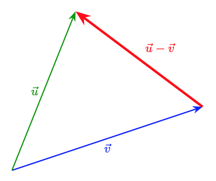
---
## 4. Combinació i independència lineal
* **Combinació lineal:** Un vector $\vec{w}$ és combinació lineal de $\vec{u}$ i $\vec{v}$ si existeixen dos nombres $a, b$ tals que:
    $\vec{w} = a\vec{u} + b\vec{v}$
* **Independència lineal:** Dos vectors $\vec{u}$ i $\vec{v}$ són linealment independents si no tenen la mateixa direcció. Al pla, qualsevol parell de vectors independents formen una **base**.

* Donada una base, tots els vectors es poden escriure, de forma única, com a combinació lineal dels vectors de la base. O sigui, tot vector $\vec{w}$ és pot escriure com $\vec{w} = a\vec{u} + b\vec{v}$ per a algun valor d'$a$ i $b$. D'aquesta forma podem associar $(a,b)$ al vector $\vec{w}$ i en diem les **components del vector**.

!!! note "A la següent representació, ho veurem tot plegat: $\vec{u}$ i $\vec{v}$ són dos vectors linealment independents i, per tant, són base. $\vec{w}$ s'escriu com a combinació lineal de la base $\{\vec{u},\vec{v}\}$ com $\vec{w} = a\vec{u} + b\vec{v}$ i, per tant, el podem expressar en components de la forma: $\vec{w}=(a,b)$"

    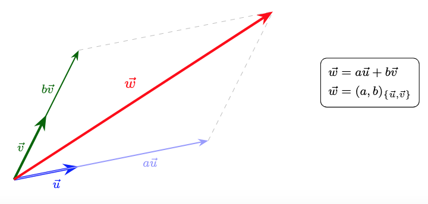
---
## 5. Base ortonormal
Per treballar, utilitzarem una base concreta que ens facilitarà alguns càlculs: la **base ortonormal**. Diem que una base és ortonormal si els vectors d'aquesta base, que es representen amb $\vec{i}$ i $\vec{j}$, compleixen:

*  $\vec{i}$ i $\vec{j}$ són ortogonals (perpendiculars) ($\vec{i} \perp \vec{j}$).
*  $\vec{i}$ i $\vec{j}$ tenen mòdul unitari ($|\vec{i}| = 1$ i $|\vec{j}| = 1$).

Qualsevol vector es pot escriure com a combinació lineal d'aquests: $\vec{v} = v_x \vec{i} + v_y \vec{j} = (v_x, v_y)$.

!!! note "En la següent representació podem veure les propietats de la base ortonormal $\{\vec{i},\vec{j}\}$ i la representació del vector $\vec{w}=(2,1.5)$"
    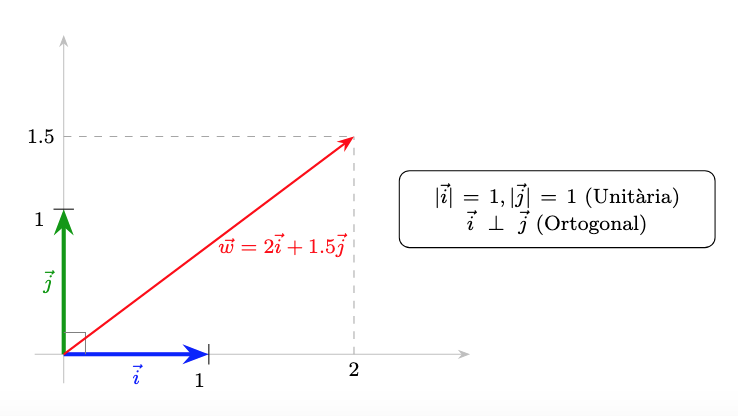
---
## 6. Operacions amb components
Donats els vectors $\vec{u} = (u_x, u_y)$ i $\vec{v} = (v_x, v_y)$:

* **Suma:** $\vec{u} + \vec{v} = (u_x + v_x, u_y + v_y)$
* **Resta:** $\vec{u} - \vec{v} = (u_x - v_x, u_y - v_y)$
* **Producte per escalar:** $k \cdot \vec{u} = (k \cdot u_x, k \cdot u_y)$
* **Combinació lineal:** $a\vec{u} + b\vec{v} = (a \cdot u_x + b \cdot v_x, a \cdot u_y + b \cdot v_y)$

!!! example "Exemple:"
    Donats els vectors $\vec{u} = (3, 1)$ i $\vec{v} = (1, 2)$, calculem les operacions bàsiques:

    **1. Suma.**
    Sumem component a component:

    $$\vec{u} + \vec{v} = (3 + 1, 1 + 2) = \mathbf{(4, 3)}$$

    **2. Resta.**
    Restem component a component:

    $$\vec{u} - \vec{v} = (3 - 1, 1 - 2) = \mathbf{(2, -1)}$$

    **3. Producte per un escalar.**
    Multipliquem el vector $\vec{u}$ per l'escalar $k = 2$:

    $$2 \cdot \vec{u} = (2 \cdot 3, 2 \cdot 1) = \mathbf{(6, 2)}$$

    **4. Combinació lineal: ($2\vec{u} + 3\vec{v}$).**
    Primer multipliquem i després sumem els resultats:

    * $2\vec{u} = (6, 2)$
    * $3\vec{v} = (3, 6)$
    * $2\vec{u} + 3\vec{v} = (6 + 3, 2 + 6) = \mathbf{(9, 8)}$
    

    

## 7. Producte escalar
El producte escalar, $\vec{u} \cdot \vec{v}$, és una operació que pren dos vectors i té com a resultat un nombre (un escalar). Si $\alpha$ és l'angle entre $\vec{u}$ i $\vec{v}$, és defineix com:

$$\vec{u} \cdot \vec{v} = |\vec{u}| \cdot |\vec{v}| \cdot \cos \alpha$$

!!! note "En la següent representació, podeu observar els vectors $\vec{u}$ (blau), $\vec{v}$ (verd) i el vector projecció de $\vec{v}$ sobre $\vec{u}$ (vermell). També s'indiquen els mòduls d'aquests tres vectors. El producte escalar és essencialment un producte de mòduls, però només es considera un vector (de mòdul $|\vec{u}|$) i la projecció de l'altre sobre el primer (de mòdul $|\vec{v}| \cdot \cos \theta$)"
    
    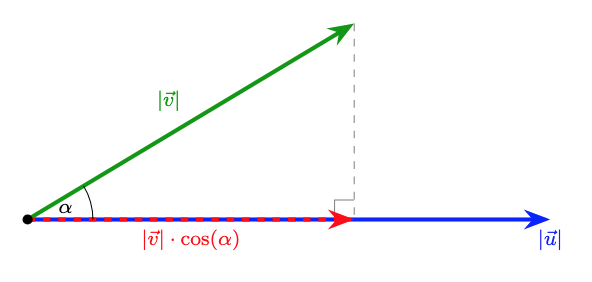

## 8. Propietats del producte escalar
Siguin $\vec{u}$, $\vec{v}$ i $\vec{w}$ vectors i $k$ un nombre real (escalar):

* **Commutativa:** $\vec{u} \cdot \vec{v} = \vec{v} \cdot \vec{u}$
* **Distributiva respecte la suma:** $\vec{u} \cdot (\vec{v} + \vec{w}) = \vec{u} \cdot \vec{v} + \vec{u} \cdot \vec{w}$
* **Associativa amb escalars:** $k \cdot (\vec{u} \cdot \vec{v}) = (k\vec{u}) \cdot \vec{v} = \vec{u} \cdot (k\vec{v})$

!!! example "Exemple"
    Calculem el producte escalar del vector $\vec{w}$ per la combinació lineal $3\vec{u} - 2\vec{v}$.

    **Dades:**
    $\vec{w} = (2, -1), \quad \vec{u} = (3, 2), \quad \vec{v} = (1, 4)$

    **Mètode 1: Aplicant la propietat distributiva**.
    Aquesta és la via més directa si ja coneixem els productes individuals:

    $$\vec{w} \cdot (3\vec{u} - 2\vec{v}) = 3(\vec{w} \cdot \vec{u}) - 2(\vec{w} \cdot \vec{v})$$

    * **Calculem $\vec{w} \cdot \vec{u}$:** $(2 \cdot 3) + (-1 \cdot 2) = 6 - 2 = 4$
    * **Calculem $\vec{w} \cdot \vec{v}$:** $(2 \cdot 1) + (-1 \cdot 4) = 2 - 4 = -2$
    * **Substituïm:** $3(4) - 2(-2) = 12 + 4 = \mathbf{16}$
 
    **Mètode 2: Resolent primer el parèntesi**

    * **Calculem la combinació lineal:**

    $$3\vec{u} - 2\vec{v} = 3(3, 2) - 2(1, 4) = (9, 6) - (2, 8) = (7, -2)$$

    * **Fem el producte escalar final amb $\vec{w}$:**

    $$(2, -1) \cdot (7, -2) = (2 \cdot 7) + (-1 \cdot -2) = 14 + 2 = \mathbf{16}$$

    **Conclusió:** Ambdós mètodes arriben al mateix resultat (**16**), confirmant que la propietat distributiva.
## 9. Ortogonalitat i producte escalar

Si dos vectors $\vec{u}$ i $\vec{v}$ son ortogonals (formen un angle $\alpha = 90^\circ$), llavors el seu producte escalar val $0$:

$$\vec{u} \cdot \vec{v} = |\vec{u}| \cdot |\vec{v}| \cdot \underbrace{\cos(90^\circ)}_{=0}=0$$

De fet, a l'inrevés també és cert. Si el producte escalar de dos vectors és $0$, llavors són ortogonals:

$$\vec{u} \perp \vec{v} \iff \vec{u} \cdot \vec{v} =0$$

El signe del producte escalar també queda determinat pel valor del cosinus ja que els mòduls $|\vec{u}|$ i $|\vec{v}|$ sempre són positius i, per tant, l'únic element que pot canviar de signe és el cosinus. 

$$ 0< \alpha <90 \implies cos(\alpha) > 0 \implies \vec{u} \cdot \vec{v} >0$$

$$ 90< \alpha <180 \implies cos(\alpha) < 0 \implies \vec{u} \cdot \vec{v} <0$$

## 10. Càlcul del producte escalar en base ortonormal
Quan treballem en una base ortonormal, el producte escalar es simplifica a la suma dels productes de les seves components.
Donats els vectors $\vec{u} = (u_x, u_y)$ i $\vec{v} = (v_x, v_y)$:

$$\vec{u} \cdot \vec{v} = u_x \cdot v_x + u_y \cdot v_y$$

!!! example "Exemple:"
    Considerem els vectors $\vec{u}$ i $\vec{v}$ expressats en les seves components en base ortonormal:
    $\vec{u} = (3, -2) \quad \text{i} \quad \vec{v} = (5, 4)$

    Multipliquem les components $x$ entre elles i les components $y$ entre elles, i després sumem els resultats:

    $$\vec{u} \cdot \vec{v} = 3 \cdot 5 + (-2) \cdot 4= 15 - 8 = \mathbf{7}$$

## 11. Càlcul del mòdul en base ortonormal
Donat el vector $\vec{u} = (u_x, u_y)$ en base ortonormal, el mòdul del vector $\vec{u}$ es calcula:

$$|\vec{u}| = \sqrt{u_x^2 + u_y^2}$$

!!! example "Exemple:"
    Donat el vector $\vec{u} = (-4, 3)$, volem calcular la seva longitud o mòdul ($|\vec{u}|$).
    
    $$|\vec{u}| = \sqrt{(-4)^2 + 3^2} = \sqrt{16 + 9} = \sqrt{25} = \mathbf{5}$$

## 12. Angle entre dos vectors
Podem calcular l'angle $\alpha$ que formen dos vectors $\vec{u}$ i $\vec{v}$ combinant les expressions anteriorment vistes:

$$\cos \alpha = \frac{\vec{u} \cdot \vec{v}}{|\vec{u}| \cdot |\vec{v}|} = \frac{u_x v_x + u_y v_y}{\sqrt{u_x^2 + u_y^2} \cdot \sqrt{v_x^2 + v_y^2}}$$

!!! example "Exemple:"
    Volem trobar l'angle $\alpha$ que formen els vectors:

    $\vec{u} = (2, 0) \quad \text{i} \quad \vec{v} = (1, \sqrt{3})$

    **1. Càlcul del producte escalar ($\vec{u} \cdot \vec{v}$):**
    
    $$\vec{u} \cdot \vec{v} = (2 \cdot 1) + (0 \cdot \sqrt{3}) = 2 + 0 = \mathbf{2}$$

    **2. Càlcul dels mòduls:** 

    $$|\vec{u}| = \sqrt{2^2 + 0^2} = \sqrt{4} = \mathbf{2}$$ 

    $$|\vec{v}| = \sqrt{1^2 + (\sqrt{3})^2} = \sqrt{1 + 3} = \sqrt{4} = \mathbf{2}$$

    **3. Aplicació de la fórmula de l'angle:**
     
    $$\cos(\alpha) = \frac{2}{2 \cdot 2} = \frac{2}{4} = \mathbf{0.5}$$

    **4. Resultat final:**

    $$\alpha = \arccos(0.5) = \mathbf{60^\circ}$$

## 13. Vectors unitaris

Donat un vector $\vec{u}$ de mòdul $|\vec{u}|$, molts cops ens pot interessar calcular el seu vector unitari associat. O sigui, un vector del mateix sentit i direcció que $\vec{u}$, però de mòdul $1$ (unitari). Aquest procés s'anomena normalitzar el vector $\vec{u}$. Per calcular el vector unitari associat a $\vec{u}$, només cal dividir-lo per seu mòdul:

$$\vec{u}_{norm} = \displaystyle\frac{\vec{u}}{|\vec{u}|}$$

!!! example "Exemple"
    Donat el vector $\vec{u} = (3, 4)$, troba el seu vector unitari.

    **1. Calculem el mòdul de $\vec{u}$:**

    $$|\vec{u}| = \sqrt{3^2 + 4^2} = \sqrt{9 + 16} = \sqrt{25} = 5$$

    **2. Dividim les components pel mòdul:**

    $$\vec{u}_{norm} = \mathbf{\left( \frac{3}{5}, \frac{4}{5} \right)}$$

  

# **Sistema de referència i punts al pla**

## 1. El Sistema de Referència
Per poder descriure la posició d'un punt, o qualsevol altre objecte geomètric, necessitarem un **sistema de referència** $R = \{O;\{\vec{i}, \vec{j}\}\}$. Com podem veure, un sistema de referència, consta de dos elements:

* **L'origen ($O$):** Un punt fix de referència (de coordenades $(0,0)$).
* **Una base ($\{\vec{i}, \vec{j}\}$):** Una base de vectors qualsevol (o sigui, dos vectors linealment independents). No obstant això, treballarem amb la base ortonormal, ja que ens facilita molts càlculs.

!!! example "Exemple"
    Per entendre la necessitat d'un sistema de referència, analitzem la següent situació: hem d'entrar a una habitació i ens hem de situar en un punt concret. Per arribar-hi, la indicació que ens donen és la següent: "ens hem de moure 4 metres". Analitzem per què sense un sistema de referència aquesta indicació no serveix de res:

    * Ens hem de moure 4 metres... però **des d'on?** Ens cal un punt inicial des del qual moure'ns. Aquest punt és l'origen $O$.
    * I ara que sé des d'on... **cap on ens movem?** ens cal una direcció i un sentit. Ja hem vist que això son característiques dels vectors, per tant una base de vectors que ens permeti escriure qualsevol direcció des de l'origen $O$, dona resposta a les nostres necessitats. 

---

## 2. Localitzem i identifiquem els punts del pla: **vectors de posició**
Ara que tenim un sistema de referència, el primer objectiu que tenim és poder **identificar** tots els punts del pla i associar-los unes **coordenades** que ens permetin **distingir-los** i treballar amb ells.  

**Com ho fem?** Per a qualsevol punt $A$ del pla, hi ha un **únic vector** que surt d'$O$ (extrem inicial) i arriba a $A$ (extrem final). Associem, doncs, aquest vector al punt $A$.  
D'aquest tipus de vectors en diem **vectors de posició** i utilitzem la notació $\overrightarrow{OA}$ per anomenar-los.  
**Com assignem coordenades al punt?** Com el vector $\overrightarrow{OA}$, amb components $(a,b)$, està unívocament vinculat al punt $A$ (respecte $O$), assignem aquestes mateixes components com a coordenades del punt. Ho escrivim: $\mathbf{A(a,b)}$.

!!! Example "Al següent exemple gràfic observem com el vector $\overrightarrow{OP}$ "apunta" des de l'origen $O$ al punt $P$. Les components del vector $\overrightarrow{OP}$ les associem com a coordenades del punt $P$"
    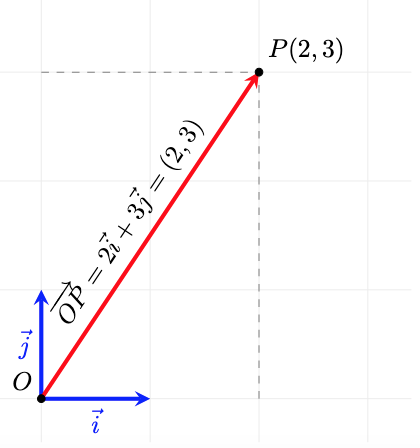

!!! Tip "Si hi pensem, aquestes coordenades dels punts són exactament iguals a les que hem fet servir sempre quan representem punts a partir dels eixos de coordenades cartesians. Això és perquè utilitzem una base ortonormal i, de fet, ens facilita la representació i els càlculs. Si la base fos una altra, això no seria així!"

## 3. Com puc anar d'un punt a un altre? **Vector entre dos punts**

Donats dos punts $A$ i $B$ qualssevol del pla, hi ha un únic vector que surt d'$A$ i té com a extrem final $B$. A aquest vector l'anomenem $\overrightarrow{AB}$. 

!!! Note "Al següent gràfic observem com el vector $\overrightarrow{AB}$ té com a inici $A$ i com a extrem final $B$"
    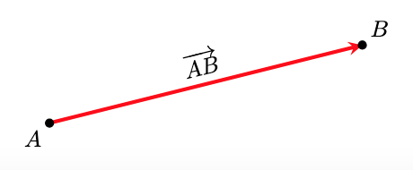

**Què ens diu el vector $\mathbf{\overrightarrow{AB}}$?** El vector $\overrightarrow{AB}$ ens diu com arribar del punt $A$ al punt $B$, o sigui, com m'he de moure des d'$A$ per arribar $B$. Si ho mirem vectorialment i tal com interpretem la suma de vectors ja ho veiem:

$$\overrightarrow{OA} + \overrightarrow{AB} = \overrightarrow{OB}$$

!!! Note ""
    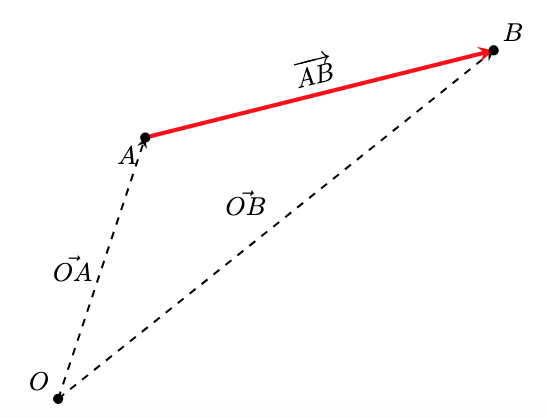

Com que els vectors de posició $\overrightarrow{OA}$ i $\overrightarrow{OB}$ s'identifiquen amb els punts $A$ i $B$, a partir d'ara, i per simplificar les expressions, els vectors de posició els escriurem com a punts:

$$A + \overrightarrow{AB} = B$$

i podem pensar que, si a un punt $A$ li apliquem (sumem) un vector ($\overrightarrow{AB}$), aquest ens transporta a un altre punt ($B$).

**I com podem calcular el vector entre dos punts?** A partir de l'expressió anterior, i també si mirem la interpretació geomètrica de la resta de vectors, tenim que:

$$A + \overrightarrow{AB} = B \implies   \overrightarrow{AB} = B-A$$

Si tenim els punts $A(x_A,y_A)$ i $B(x_B,y_B)$, el vector , $\overrightarrow{AB}$, que els uneix es calcula com:

$$\overrightarrow{AB} = B - A = (x_B - x_A, y_B - y_A)$$

!!! Example "Vegem un exemple gràfic amb coordenades. És fàcil veure que el vector $\overrightarrow{AB}$ ens diu com canvien, o quina és la diferència entre, les coordenades dels punts $A$ i $B$."
    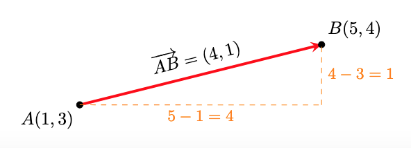

!!! Example "Observem que si apliquem el vector $\overrightarrow{AB}=(4,1)$ al punt $A(1,3)$ obtenim el punt $B(5,4)$:"
    
    $$A+\overrightarrow{AB} = (1,3)+(4,1)=(5,4)=B$$

##4. Punt mitjà
Un problema que podem resoldre amb el que hem vist fins ara, és com trobar el **punt mitjà**, $M$, entre 2 punts donats $A(x_A,y_A)$ i $B(x_B,y_B)$.

!!! Note "Observem que el el vector meitat d'$\overrightarrow{AB}$ ens porta fins al punt meitat que cerquem"
    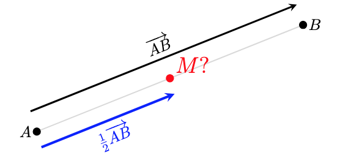

**Càlcul de les coordenades del punt mitjà:**

* Calculem $\overrightarrow{AB}$: $(x_B-x_A,y_B-y_A)$
* Calculem $\displaystyle\frac{1}{2}\overrightarrow{AB}=\left(\frac{x_B-x_A}{2},\frac{y_B-y_A}{2}\right)$
* Si al punt $A$ li aplico $\displaystyle\frac{1}{2}\overrightarrow{AB}$ arribo al punt mitjà, $M$, entre $A$ i $B$
* Fem $M=A+\displaystyle\frac{1}{2}\overrightarrow{AB}=\left( x_A+\frac{x_B-x_A}{2}, y_A+\frac{y_B-y_A}{2} \right)$
* Obtenim:
  
$$\mathbf{M=\left( \frac{x_A+x_B}{2},\frac{y_A+y_B}{2} \right)}$$

!!! Example "Vegem un exemple gràfic amb coordenades:"
    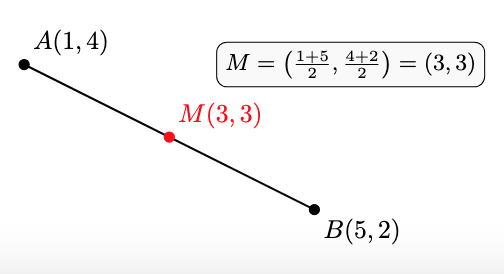

##5. Punt simètric

Una variant del problema anterior és com trobar el **punt simètric**, $P'$, d'un punt $P(x_P,y_P)$, respecte d'un punt de simetria, $S(x_S,y_S)$. En lloc d'aplicar el vector meitat, apliquem el vector doble: 

$$P'= P+2\overrightarrow{PS}$$

$$\mathbf{P'=(2x_S-x_P,2y_S-y_P)}$$

!!! Example "Vegem un exemple gràfic amb coordenades:"
    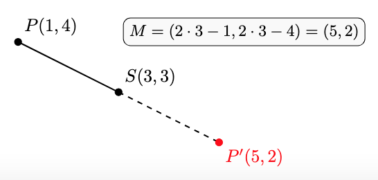

##6. Quan només m'interessa la direcció: **vectors directors**
Hi ha moltes situacions en què l'interessant d'un vector és la direcció i no entre quins punts es troba. En aquests contexts els anomenarem **vectors directors**.

Per representar un vector director utilitzarem una lletra minúscula com per exemple $\vec{d}$ 

!!! Note "En la següent representació podem veure que la informació que en dona el vector $\vec{d}$ és la de la direcció de les rectes que es mostren. No representa a cap punt ni ens importa si està entre dos punts concrets."
    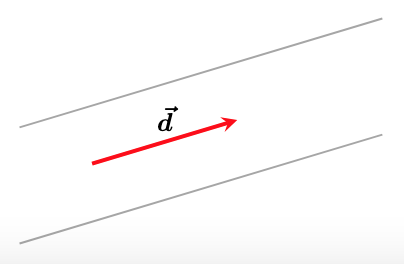

Si dos vectors $\vec{d_1}=(x_{d1},y_{d1})$ i $\vec{d_2}=(x_{d2},y_{d2})$ tenen la **mateixa direcció**, llavors són **proporcionals**:

$$\mathbf{\vec{d_1} \parallel \vec{d_2} \implies \vec{d_1}=k\cdot \vec{d_2} \implies \frac{x_{d1}}{x_{d2}}=\frac{y_{d1}}{y_{d2}}}$$

!!! example "Exemple numèric: Comprovació de proporcionalitat"
    Anem a verificar si els vectors $\vec{u} = (2, 3)$ i $\vec{v} = (4, 6)$ tenen la mateixa direcció:

    **Mètode vectorial:** Busquem si existeix un nombre $k$ tal que $\vec{v} = k \cdot \vec{u}$:

    $$(4, 6) = k \cdot (2, 3) \implies (4, 6) = (2k, 3k)$$
    
    Si aïllem la $k$ en ambdues coordenades:

    * $4 = 2k \implies k = 2$
    * $6 = 3k \implies k = 2$
    
    Com que $k$ és la mateixa, diem que $\vec{v} = 2\vec{u}$.

    ---

    **Mètode per components:** Dividim les coordenades $x$ i $y$ dels dos vectors:
    
    $$\frac{v_x}{u_x} = \frac{4}{2} = 2$$

    $$\frac{v_y}{u_y} = \frac{6}{3} = 2$$
    
    

    **Conclusió:** Com que la raó és constant ($2 = 2$), els vectors són **proporcionals** i, per tant, **paral·lels**.

Hi ha situacions en què la informació que ens interessarà del vector entre dos punts $A$ i $B$ és la direcció. Per exemple, ens pot interessar la direcció de la recta que passa per aquests dos punts. En aquest context el vector $\overrightarrow{AB}$ fa les funcions d'un vector director $\vec{d}$

!!! Note "En la següent representació podem veure que el vector  $\overrightarrow{AB}$ el podem entendre com el vector director $\vec{d}$ de la recta que conté a $A$ i $B$"
    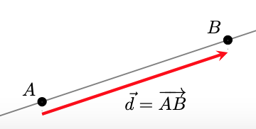

##7. Punts alineats

Amb tot el que tenim, ja podem fer front a un altre problema: donats tres punts qualssevol $A$, $B$ i $C$ volem saber si estan alineats o no.  
**Què passa si estan alineats?** Si els tres punts estan alineats els vectors $\overrightarrow{AB}$ i $\overrightarrow{BC}$ (o $\overrightarrow{AC}$) tenen la mateixa direcció, o sigui són proporcionals, i aquesta és la condició que ens permet comprovar si estan alineats o no.

!!! Note "Aquí observem els tres punts alineats i com les direccions dels vectors entre tots els punts són la mateixa i, per tant, són proporcionals"
    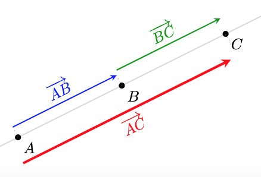

!!! Note "Aquí observem els tres punts no alineats i com les direccions dels vectors entre tots els punts no tenen les mateixes direccions i, per tant, no són proporcionals"
    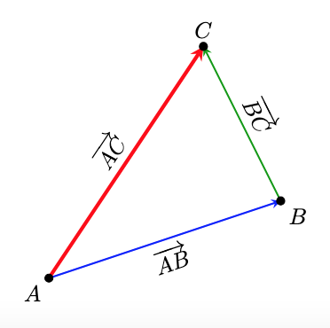

**Condició analítica (per coordenades)**

Per verificar si tres punts estan alineats sense necessitat de dibuixar-los, treballem amb les seves coordenades. Siguin els punts:
$A(x_1, y_1)$, $B(x_2, y_2)$ i $C(x_3, y_3)$.

* **Pas 1: Trobar els vectors entre els punts**  
Primer, calculem els components dels vectors $\vec{AB}$ i $\vec{BC}$:

$$\vec{AB} = (x_2 - x_1, \ y_2 - y_1)$$

$$\vec{BC} = (x_3 - x_2, \ y_3 - y_2)$$

* **Pas 2: Verificar la proporcionalitat**  
Els punts estan alineats si les coordenades dels vectors són proporcionals. Això es compleix si:

$$\frac{x_2 - x_1}{x_3 - x_2}=\frac{y_2 - y_1}{y_3 - y_2}$$

$$(x_2 - x_1) \cdot (y_3 - y_2) = (y_2 - y_1) \cdot (x_3 - x_2)$$

!!! Examples "Exemples numèrics:"

    **Cas A: Punts alineats**
    Comprovem si els punts $A(-1, -2)$, $B(1, 2)$ i $C(2, 4)$ estan alineats.

    Calculem els vectors entre els punts:

    * $\overrightarrow{AB} = (1 - (-1), 2 - (-2)) = (2, 4)$
  
    * $\overrightarrow{BC} = (2 - 1, 4 - 2) = (1, 2)$

    Verifiquem la proporció:

    $$\frac{2}{1} = \frac{4}{2} \implies 2 = 2$$

    ---

    **Cas B: Punts no alineats**

    Comprovem si els punts $P(0, 1)$, $Q(2, 3)$ i $R(4, 0)$ estan alineats.

    Calculem els vectors components:

    * $\overrightarrow{PQ} = (2 - 0, 3 - 1) = (2, 2)$
  
    * $\overrightarrow{QR} = (4 - 2, 0 - 3) = (2, -3)$

    Verifiquem la proporció:
   
    $$\frac{2}{2} \neq \frac{2}{-3}$$

  

# **Equacions de la recta al pla**

Ara que ja sabem treballar amb els punts del pla utilitzant coordenades, ens cal poder fer-ho amb un altre objecte geomètric fonamental: **la recta**.
Per determinar una recta de forma única al pla, necessitem conèixer:

* Un **punt** de la recta: $A(x_A, y_A)$
* Una **direcció**, donada per un **vector director**: $\vec{d} = (d_1, d_2)$

Alternativament, també podem determinar una recta si sabem dos punts per on passa. En aquest cas, calculant el **vector entre els dos punts**, ja tenim la **direcció** de la recta. 

En aquest apartat, l'**objectiu** és descriure les rectes mitjançant equacions. O sigui, donada una recta, volem una equació que tingui com a solució tots els punts de la recta.  
Veurem que tenim diferents tipus d'equacions per representar qualsevol recta

---

## 1. Equació vectorial
L'equació vectorial es basa en la idea que qualsevol punt $X(x, y)$ de la recta s'obté sumant al punt $A$ (un punt qualsevol de la recta) un múltiple del vector director $\vec{d}$ (un vector director de la recta).

$$X = A + k\cdot \vec{d}, \hspace{.5cm}k \in \mathbb{R}$$

En coordenades:

$$(x, y) = (x_A, y_A) + k \cdot (d_1, d_2), \hspace{.5cm}k \in \mathbb{R}$$

!!! note "Interpretació"
    Si anem variant el valor de $k$, ens anem movent al llarg de la recta. Per exemple, per $k=0$ som al punt $A$, per $k=1$ som al punt $A+\vec{d}$, per $k=2$ som al punt $A+2\vec{d}$... i així per a qualevol valor de $k$.
    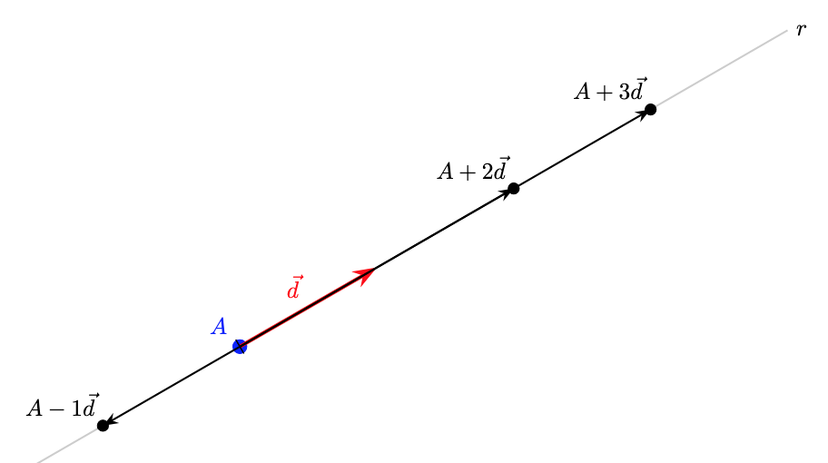

---

## 2. Equacions paramètriques
A partir de l'equació vectorial, si la descomponem component a component, obtenim un sistema de dues equacions que anomenem paramètriques:

$$\begin{cases} x = x_A + k \cdot d_1 \\ y = y_A + k \cdot d_2 \end{cases}$$

!!! Example "Exemple"
    Volem les equacions vectorial i paramètrica de la recta que passa pel punt $A(1, 2)$ i té com a vector director $\vec{d}(3, 4)$:
    
    * **Equació vectorial:**
  
        $$(x, y) = (1, 2) + k \cdot (3, 4)$$
    * **Equació paramètrica:**
  
        $$
        \begin{cases} 
        x = 1 + 3k \\ 
        y = 2 + 4k 
        \end{cases}
        $$
    
    Per exemple, 

    * **(eq. paramètrica)** Si $k=2$, obtenim el punt $P(7, 10)$, ja que:
    $x = 1 + 3(2) = 7$ i $y = 2 + 4(2) = 10$.
    * **(eq. vectorial)** Si $k =-1$, obtenim el punt $P(-2,-2)$, ja que $(x,y)=(1,2)-1\cdot (3,4)=(1,2)-(3,4)=(-2,-2)$.
---

## 3. Equació contínua
Si aïllem el paràmetre $k$ en les dues equacions paramètriques i igualem els resultats, obtenim l'equació contínua:

$$k = \frac{x - x_A}{d_1} \quad \text{i} \quad k = \frac{y - y_A}{d_2}$$

$$\mathbf{\frac{x - x_A}{d_1} = \frac{y - y_A}{d_2}}$$

!!! warning "Atenció"
    Aquesta equació només es pot fer servir si les dues components del vector director són diferents de zero $(d_1 \neq 0, d_2 \neq 0)$.

!!! note "Pas a l'equació contínua"
    Si aïllem el paràmetre $k$ a les equacions paramètriques de l'exemple anterior:
    
    * $x = 1 + 3k \implies k = \displaystyle\frac{x - 1}{3}$
    * $y = 2 + 4k \implies k = \displaystyle \frac{y - 2}{4}$
    
    Igualant les dues expressions, obtenim l'**equació contínua**:
    
    $$\frac{x - 1}{3} = \frac{y - 2}{4}$$

---

## 4. Equació punt-pendent

Per obtenir l'equació punt pendent, partim de la contínua i passem a l'altre membre de l'equació $d_2$:

$$y - y_A=\frac{d_2}{d_1}(x-x_A)$$

$$\mathbf{y - y_A = m(x - x_A)}$$

El quocient $m=\displaystyle\frac{d_2}{d_1}$ és el pendent de la recta. I, de fet, tenim que $\mathbf{ m= tan(\alpha) }$, on $\alpha$ és l'angle de la recta respecte de la horitzontal:

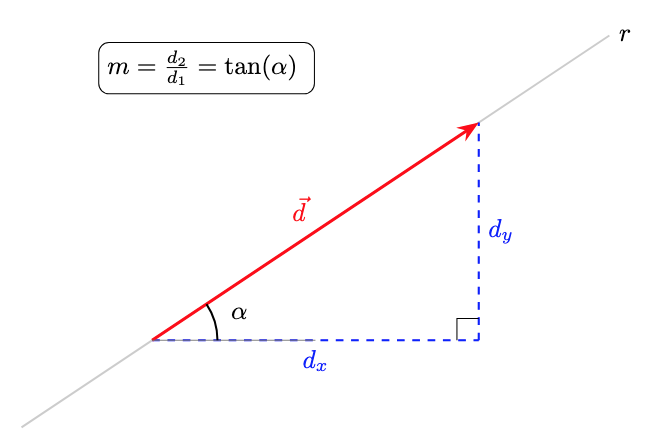{width=70%}

Observem que, per semblança de triangles, el pendent (tangent d'$\alpha$) de la recta no canvia sigui quin sigui el vector director. El pendent (inclinació) de la recta només depèn de l'angle $\alpha$:

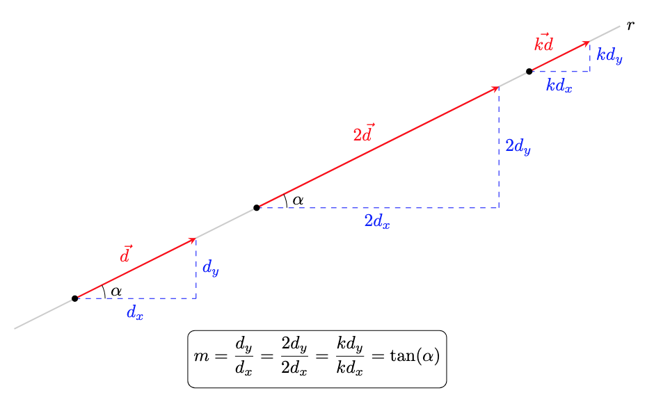{width=90%}

Alguns casos particulars:

* Si $m=0$, llavors $d_y=0$ i la recta és horitzontal.
* Si $m=1$, llavors $d_x=d_y$ i la recta te un angle $\alpha=45^{\circ}$ respecte l'horitzontal.

També podem observar que si $d_x=1$, llavors $m=d_y$ i tenim que:  
**Si $m$ és el pendent d'una recta $\implies$ $\vec{d}=(1,m)$ és vector director de la recta.**

!!! Note "Interpretació del pendent ($\mathbf{m}$)"
    Amb el que acabem de veure, podem interpretar que, per cada unitat que augmentem horitzontalment, n'augmentem $m$ verticalment.

!!! Example "Exemple: equació a partir del pendent (o la direcció)"
    Seguim les dades dels exemples anteriors:

    * **Punt:** $A(1, 2)$
    * **Pendent:** $m = \displaystyle\frac{4}{3}$ (recorda que això ve del vector $\vec{d}(3, 4)$)

    * L'equació punt-pendent té la forma:

    $$y - y_a = m \cdot (x - x_a)$$

    * Substituïm $x_a = 1$, $y_a = 2$ i $m = 4/3$:

    $$y - 2 = \frac{4}{3} \cdot (x - 1)$$

!!! Example "Exemple: equació a partir de l'angle"
    Volem trobar l'equació de la recta que passa pel punt **$A(2, 1)$** i forma un angle de **$30^\circ$** respecte de l'horitzontal.

    * El pendent és la tangent de l'angle d'inclinació:
  
    $$m = \tan(30^\circ) = \frac{\sqrt{3}}{3}$$

    * Substituïm el punt $A(2, 1)$ i el pendent $m = \frac{\sqrt{3}}{3}$ a la fórmula:

    $$y - 1 = \frac{\sqrt{3}}{3}(x - 2)$$

    * I si necessitem un **vector director**?
    Ja hem vist que $(1,m)$ és vector director, per tant, $(1,\displaystyle\frac{\sqrt{3}}{3})$ ho és.  
    En veritat, qualsevol vector proporcional a aquest ens serviria:

    $$\vec{d} = (3, \sqrt{3})$$

---
## 5. Equació explícita
Si aïllem completament la $y$ de l'equació anterior, obtenim l'equació explícita de la recta, que per altra banda és la forma més habitual en què trobem les funcions lineals:

$$y-y_A = m(x-x_A)\implies y=mx - mx_A+y_A\implies y=mx +\underbrace{(- mx_A+y_A)}_{=n}$$

$$\mathbf{y = mx + n}$$

* $\mathbf{m}$: Pendent.
* $\mathbf{n}$: Ordenada a l'origen. Observem que per a $x=0$, tenim que $y=n$, o sigui $(0,n)$ és el punt de tall de la recta amb l'eix d'ordenades $OY$.

Vegem-ho gràficament:

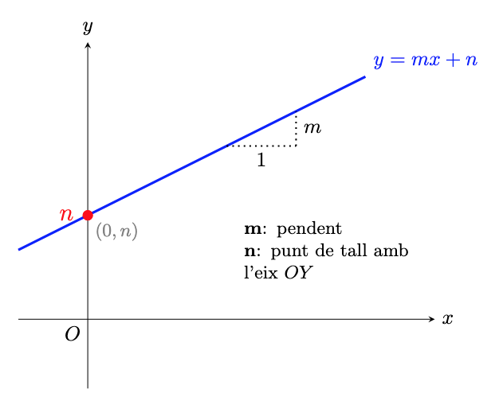{width=75%}

!!! Example "Exemple: pas a l'equació explícita"
    D'una recta que passa per $A(1, 2)$ amb $m = 4/3$:
    
    * **Punt-pendent:** $y - 2 = \displaystyle\frac{4}{3}(x - 1)$
    * **Operem:** $y - 2 = \displaystyle\frac{4}{3}x - \frac{4}{3}$
    * **Aïllem:** $y = \displaystyle\frac{4}{3}x - \frac{4}{3} + 2$
    
    **Equació Explícita:**

    $$y = \frac{4}{3}x + \frac{2}{3}$$
    
    * On el tall amb l'eix $OY$ és $n = 2/3$.

---

## 6. Equació implícita (o general)
Si passem tots els termes a un costat de la igualtat per deixar-la igualada a zero, obtenim la forma general:

$$\mathbf{Ax + By + C = 0}$$

Si ho fem a partir de l'equació continua (des de l'explícita seria similar) tenim que:  

$$\frac{x - x_A}{d_1} = \frac{y - y_A}{d_2}\implies d_2(x-x_A)=d_1(y-y_A)\implies$$

$$d_2x-d_2x_A=d_1y-d_1y_A\implies \underbrace{d_2}_{A}x\underbrace{-d_1}_{B}y\underbrace{-d_2x_A+d_1y_A}_{C}=0$$

Del que acabem de veure, podem deduir la següent informació:

* Un **vector director** és $\vec{d} = (-B, A)$.
* El **pendent** és $m = -\frac{A}{B}$.
* Un **vector normal** (perpendicular a la recta) és $\vec{n} = (A, B)$.
  > Observem que el producte escalar $\vec{d}\cdot \vec{n}=0$

---

!!! example "L'exemple complet"
    Troba les equacions de la recta que passa per $A(1, 2)$ amb vector director $\vec{d}(3, 4)$:

    * **Vectorial:** $(x, y) = (1, 2) + k(3, 4)$
    * **Paramètrica:** $\begin{cases} x = 1 + 3k \\ y = 2 + 4k \end{cases}$
    * **Contínua:** $\frac{x-1}{3} = \frac{y-2}{4}$
    * **Punt-pendent:** $y - 2 = \frac{4}{3}(x - 1)$
    * **Explícita:** $y = \frac{4}{3}x + \frac{2}{3}$
    * **Implícita o general:** $4x - 3y + 2 = 0$
  

# **Paral·lelisme i perpendicularitat**

En aquest apartat analitzarem les relacions de paral·lelisme i perpendicularitat entre dues rectes $r$ i $s$ a partir dels seus elements característics: els vectors directors, els vectors normals i els pendents.

---

## 1. Paral·lelisme
Dues rectes són paral·leles ($r \parallel s$) si tenen la **mateixa direcció** i no són coincidents (no són la mateixa recta).

**Com comprovar si dues rectes tenen la mateixa direcció?**

* **Amb vectors directors:** Els vectors $\vec{d_r}$ i $\vec{d_s}$ han de ser **proporcionals**.
  
    $$\vec{r} \parallel \vec{s} \iff \vec{d_r} = k \cdot \vec{d_s} \iff \frac{d_{rx}}{d_{sx}} = \frac{d_{ry}}{d_{sy}}$$

* **Amb els pendents:** Les rectes han de tenir el **mateix pendent**.
  
    $$\vec{r} \parallel \vec{s} \iff m_r = m_s$$

* **Amb vectors normals:** Els seus vectors normals també han de ser proporcionals.
  
    $$\vec{r} \parallel \vec{s} \iff \vec{n_r} = k \cdot \vec{n_s}$$

Observem gràficament com els vectors directors (i els normals) de les dues rectes han de tenir la mateixa direcció per a que les rectes siguin paral·leles:
{width=75%}

**Com comprovar si dues rectes són paral·leles o coincidents?**

Dues rectes paral·leles no tenen cap punt en comú i dues rectes coincidents els tenen tots en comú, per tant, si prenem un punt d'una recta i comprovem si pertany o no a l'altra, ja sabrem si són coincidents o paral·leles.

!!! example "Exemple: Comprovació de paral·lelisme"
    Donades les rectes:  

    $$r: 2x - 3y + 5 = 0 \implies \vec{d_r} = (3, 2)$$ 
    
    $$s: y = \frac{2}{3}x + 1 \implies m_s = \frac{2}{3}$$

    **Comprovació:**

    1. Com que $\vec{d_r} = (3, 2)$, el pendent de $r$ és $m_r =\displaystyle \frac{2}{3}$.  
    2. Com que $m_r = m_s =\displaystyle \frac{2}{3}$, les rectes tenen la mateixa direcció.
    3. Vegem si són o no coincidents: el punt $(0,1)\in s$, però no compleix l'equació de $\mathbf{r}$: $2\cdot 0-3\cdot1 +5 \neq 0$, per tant **són paral·leles**.
   

!!! example "Exemple de trobar una paral·lela a una recta donada"
  
    Troba l'equació de la recta $s$ que és paral·lela a $r: 3x - 4y + 5 = 0$ i que passa pel punt $P(2, -1)$.

    **Mètode 1: Utilitzant l'equació general**

    Si dues rectes són paral·leles, els seus coeficients $A$ i $B$ són idèntics (o proporcionals). Per tant, la recta $s$ tindrà la forma:

    $$3x - 4y + C = 0$$

    Només ens falta trobar el nou valor de $C$ substituint les coordenades del punt $P(2, -1)$:

    * Substituïm $x = 2$ i $y = -1$:
  
    $$3(2) - 4(-1) + C = 0$$

    $$6 + 4 + C = 0$$
    
    $$10 + C = 0 \implies C = -10$$

    * **Resultat:** L'equació de la recta paral·lela és: $\mathbf{s: 3x - 4y - 10 = 0}$

    **Mètode 2: Utilitzant el vector director**

    * De la recta $r: 3x - 4y + 5 = 0$, el vector normal és $\vec{n} = (3, -4)$. Per tant, el vector director és $\vec{d} = (4, 3)$.
    * Com que $s \parallel r$, la recta $s$ té el mateix vector director $\vec{d} = (4, 3)$ i passa per $P(2, -1)$.
    * Equació contínua:
  
    $$\frac{x - 2}{4} = \frac{y + 1}{3}$$

    * Equació general: multipliquem en creu:
  
    $$3(x - 2) = 4(y + 1) \implies 3x - 6 = 4y + 4 \implies \mathbf{3x - 4y - 10 = 0}$$

---

## 2. Perpendicularitat
Dues rectes són perpendiculars ($r \perp s$) si es tallen formant un **angle de $90^\circ$**.

### Com comprovar la perpendicularitat?

* **Amb vectors directors:** El **producte escalar** dels seus vectors directors ha de ser **zero** (vectors ortogonals).
  
    $$r \perp s \iff \vec{d_r} \cdot \vec{d_s} = 0 \iff d_{rx} \cdot d_{sx} + d_{ry} \cdot d_{sy} = 0$$

* **Amb els pendents:** El pendent d'una recta és l'oposat de l'invers de l'altra.
  
    $$r \perp s \iff m_r \cdot m_s = -1 \implies m_s = -\frac{1}{m_r}$$

* **Amb vectors normals:** Els vectors normals de les rectes també tenen producte escalar zero (també són ortogonals). 

$$r \perp s \iff \vec{n_r} \perp \vec{n_s} \iff \vec{n_r}\cdot \vec{n_s}=0$$

* A més el **vector normal** d'una recta ha de ser paral·lel al **vector director** de l'altra.
  
$$r \perp s \iff  \vec{n_r} \parallel \vec{d_s}$$

Observem gràficament com els vectors directors (i els normals) de les dues rectes han de ser ortogonals perquè les rectes siguin perpendiculars:
{width=80%}

!!! example "Exemple: Trobar una recta perpendicular"
    Troba l'equació de la recta $s$ perpendicular a $r: y = 2x - 3$ que passa pel punt $P(1, 4)$.

    1. El pendent de $r$ és $m_r = 2$.
    2. El pendent de la recta perpendicular serà $m_s = \displaystyle-\frac{1}{2}$.
    3. Fem servir l'equació punt-pendent:
   
    $$y - 4 = -\frac{1}{2}(x - 1)$$

---

## 3. Identificació d'elements característics segons l'equació

A la següent taula es resumeix com extreure el **vector director** ($\vec{d}$), el **vector normal** ($\vec{n}$) i el **pendent** ($m$) a partir de les diferents formes de l'equació de la recta.

| Tipus d'equació | Expressió matemàtica | Vector director $\vec{d}$ | Vector normal $\vec{n}$ | Pendent $m$ |
| :--- | :--- | :--- | :--- | :--- |
| **Paramètrica** | $\begin{cases} x = x_A + k \cdot d_1 \\ y = y_A + k \cdot d_2 \end{cases}$ | $(d_1, d_2)$ | $(-d_2, d_1)$ | $\displaystyle\frac{d_2}{d_1}$ |
| **Contínua** | $\displaystyle\frac{x - x_A}{d_1} = \frac{y - y_A}{d_2}$ | $(d_1, d_2)$ | $(-d_2, d_1)$ | $\displaystyle\frac{d_2}{d_1}$ |
| **Explícita** | $y = mx + n$ | $(1, m)$ | $(-m, 1)$ | $m$ |
| **General** | $Ax + By + C = 0$ | $(-B, A)$ | $(A, B)$ | $\displaystyle-\frac{A}{B}$ |

!!! tip "Observació sobre el pas de director a normal"
    Recorda que per qualsevol recta, el vector director i el vector normal són sempre perpendiculars entre ells $(\vec{d} \cdot \vec{n} = 0)$. Per això, si coneixes $\vec{d} = (v_1, v_2)$, pots obtenir $\vec{n}$ intercanviant les coordenades i canviant un signe: $\vec{n} = (-v_2, v_1)$.

---

## 4. Exemple pràctic

Partirem d'una recta escrita en **forma vectorial** i mirarem el paral·lelisme i ortogonalitat respecte d'altres rectes:

$$r: (x, y) = (1, 3) + k \cdot (2, -1)$$

* **Punt conegut ($P_r$):** $(1, 3)$
* **Vector director ($\vec{d_r}$):** $(2, -1)$

**Cas 1: Rectes Perpendiculars**

Donada la recta $s$ en forma contínua:

$$s:\frac{x - 1}{2} = \frac{y - 3}{4}$$

* El **vector director** de $s$ són els denominadors de l'equació contínua: $\vec{d}_s = (2, 4)$.
* Mirem si els vectors, $d_r$ i $d_s$, són **proporcionals**:
  
$$\frac{2}{2} \neq \frac{-1}{4}$$

* Per tant, les rectes **no són paral·leles** i es tallen.
* Comprovem l'ortogonalitat dels vectors directors: 
 
$$\vec{d_r} \cdot \vec{d_s} = 2\cdot 2 + (-1)\cdot 4 = 0 \implies r \perp s$$

* **Conclusió:** Les rectes són **perpendiculars**.

**Cas 2: Rectes Paral·leles**

Donada la recta $t$ en forma general:

$$t:x + 2y + 8 = 0$$

* El vector **normal** és $\vec{n}_t = (1, 2)$, per tant el **director** és $\vec{d}_t = (-2, 1)$.
* $\vec{d}_r = (2, -1)$ i $\vec{d}_t = (-2, 1)$ **són proporcionals**: $\vec{d_r}=-1\cdot \vec{d_s}$.
*  Mirem si el punt $P_r(1, 3)$ satisfà l'equació de $t$:
  
$$1 + 2(3) + 8 = 15 \neq 0$$

* **Conclusió:** Tenen la mateixa direcció, però no comparteixen punts, per tant, són **paral·leles**.

**Cas 3: Rectes Coincidents**

Donada la recta $u$ en forma paramètrica:

$$u:\begin{cases} x = 3 + 4\lambda \\ y = 2 - 2\lambda \end{cases}$$

* El vector director és $\vec{d}_u = (4, -2)$.
* $\vec{d_u} = (4, -2)$ és proporcional a $\vec{d_r} = (2, -1)$: $\vec{d_u}=2\cdot \vec{d_r}$.
* Substituïm $P_r(1, 3)$ a les equacions de $u$:
  
$$1 = 3 + 4\lambda \implies \lambda = -0.5$$

$$3 = 2 - 2\lambda \implies \lambda = -0.5$$

* **Conclusió:** Tenen la mateixa direcció i tots els punts comuns, o sigui, són **coincidents**.

  

# **Posició relativa de dues rectes al pla**

Un cop hem estudiat el paral·lelisme i la perpendicularitat, podem analitzar més generalment com podem trobar dues rectes, $r$ i $s$, al pla.

## Els tres casos possibles
Al pla, dues rectes només es poden trobar en una d'aquestes tres situacions:

1.  **Rectes paral·leles:** Les rectes no es tallen mai (no tenen punts en comú).
2.  **Rectes coincidents:** Són la mateixa recta (tenen tots els punts en comú).
3.  **Rectes secants:** Les rectes es tallen en un únic punt (la perpendicularitat és un cas particular de dues rectes secants).

Vegem gràficament aquestes tres possibilitats de posició relativa entre dues rectes:

{width=95%}

---

## Estudi segons el vector director
Si disposem dels vectors directors de les dues rectes, $\vec{d}_r$ i $\vec{d}_s$, l'anàlisi per determinar la posició relativa de les dues rectes segueix aquest ordre lògic:

* **Pas 1: Comprovar la direcció.** Mirem si els vectors directors són proporcionals $(\vec{d}_r = k \cdot \vec{d}_s)$.
    * Si **no són** proporcionals: Les rectes són **secants** i es tallen en un únic punt. Aquest punt ha de ser solució de les dues equacions de les rectes.
    * Si **són** proporcionals: Pot passar que siguin **paral·leles** o **coincidents** i per determinar-ho, passem al segon pas.

* **Pas 2: Comprovar un punt.** Agafem un punt qualsevol de la primera recta ($P_r \in r$) i mirem si pertany a la segona ($s$):
    * Si $P_r \notin s$: Les rectes són **paral·leles**.
    * Si $P_r \in s$: Les rectes són **coincidents**.

---

## Estudi segons l'Equació General
Aquest mètode és el més ràpid si tenim les rectes expressades en forma general:

$$r: Ax + By + C = 0$$

$$s: A'x + B'y + C' = 0$$

Simplement hem de comparar les raons dels seus coeficients:

1. **Rectes secants**
Els coeficients de $x$ i $y$ no mantenen la mateixa proporció. Això indica diferent direcció o pendent de cada recta:

$$\frac{A}{A'} \neq \frac{B}{B'}$$

1. **Rectes paral·leles**
Els coeficients de $x$ i $y$ són proporcionals, però el terme independent no ho és:

$$\frac{A}{A'} = \frac{B}{B'} \neq \frac{C}{C'}$$

3. **Rectes coincidents**
Tots els coeficients mantenen la mateixa proporció (una equació és múltiple de l'altra):

$$\frac{A}{A'} = \frac{B}{B'} = \frac{C}{C'}$$

!!! example "Estudi de posicions relatives"

    Donada la recta **$r: 2x - 4y + 6 = 0$**, determina la posició relativa respecte a les següents rectes:

    **Recta** $\mathbf{s: 3x - 6y + 9 = 0}$
    
    * Comparem les raons:

    $$\frac{A}{A'} = \frac{2}{3}$$

    $$\frac{B}{B'} = \frac{-4}{-6} = \frac{2}{3}$$

    $$\frac{C}{C'} = \frac{6}{9} = \frac{2}{3}$$

    * **Conclusió:** Com que $\displaystyle\frac{2}{3} = \frac{2}{3} = \frac{2}{3}$, totes les raons són iguals. Les rectes són **COINCIDENTS**.

    **Recta** $\mathbf{t: x - 2y + 5 = 0}$

    * Comparem les raons:

    $$\frac{A}{A'} = \frac{2}{1} = 2$$

    $$\frac{B}{B'} = \frac{-4}{-2} = 2$$
 
    $$\frac{C}{C'} = \frac{6}{5} = 1.2$$

    * **Conclusió:** Com que $\displaystyle\frac{A}{A'} = \frac{B}{B'} \neq \frac{C}{C'}$, tenen la mateixa direcció però diferent ordenada a l'origen. Les rectes són **PARAL·LELES**.

    **Recta** $\mathbf{u: 3x + y - 2 = 0}$
    
    * Comparem les raons:

    $$\frac{A}{A'} = \frac{2}{3}$$

    $$\frac{B}{B'} = \frac{-4}{1} = -4$$

    * **Conclusió:** Com que $\frac{2}{3} \neq -4$, la proporció dels coeficients directors ja és diferent. No cal ni mirar el terme $C$. Les rectes són **SECANTS**.

---

## Taula resum de les raons

| Comparació | Tipus de sistema | Posició Relativa |
| :--- | :--- | :--- |
| $\frac{A}{A'} \neq \frac{B}{B'}$ | Sistema Compatible Determinat | **Secants** (1 punt de tall) |
| $\frac{A}{A'} = \frac{B}{B'} \neq \frac{C}{C'}$ | Sistema Incompatible | **Paral·leles** (0 punts comuns) |
| $\frac{A}{A'} = \frac{B}{B'} = \frac{C}{C'}$ | Sistema Compatible Indeterminat | **Coincidents** (infinits punts, són la mateixa recta) |

---

## Càlcul del punt de tall entre rectes secants

Quan hem determinat que dues rectes són **secants** ($\frac{A}{A'} \neq \frac{B}{B'}$), sabem que es tallen en un únic punt $I(x_0, y_0)$. Aquest punt és la solució del sistema d'equacions format per les dues rectes.

O sigui, per trobar el punt de tall, hem de resoldre el sistema:

$$
\begin{cases} 
Ax + By + C = 0 \\
A'x + B'y + C' = 0 
\end{cases}
$$

Podem utilitzar qualsevol dels mètodes habituals (substitució, igualació o reducció).

---

!!! example "Exemple"
    Troba el punt de tall entre les rectes secants:

    $r: 2x - 3y + 5 = 0$
    
    $s: x + 2y - 8 = 0$

    **Mètode de reducció**   
    Volem eliminar una de les incògnites. Multipliquem la segona equació ($s$) per $-2$ per eliminar la $x$:

    * Mantenim $r$: $2x - 3y = -5$
    * Multipliquem $s$ per $-2$: $-2x - 4y = -16$
    * Sumem les dues equacions:
   
    $$(2x - 2x) + (-3y - 4y) = -5 - 16$$

    $$-7y = -21 \implies y = \frac{-21}{-7} = 3$$

    * Substituïm $y=3$ a la recta $s$:
   
    $$x + 2(3) - 8 = 0 \implies x + 6 - 8 = 0 \implies x = 2$$

    * **Punt de tall:** $I(2, 3)$

    **Mètode de substitució**
    Aquest mètode és útil si una de les incògnites és fàcil d'aïllar (com la $x$ a la recta $s$):

    * Aïllem $x$ de la recta $s$:
    
    $$x = 8 - 2y$$
 
    * Substituïm aquesta expressió a la recta $r$:
  
    $$2(8 - 2y) - 3y + 5 = 0$$

    $$16 - 4y - 3y + 5 = 0$$

    $$21 - 7y = 0 \implies 7y = 21 \implies y = 3$$
    
    * Trobem la $x$:
    
    $$x = 8 - 2(3) = 2$$

    * **Punt de tall:** $I(2, 3)$

  

