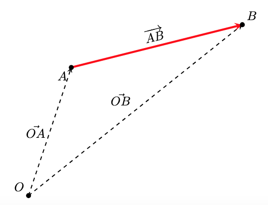
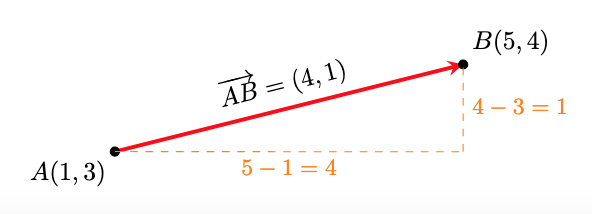
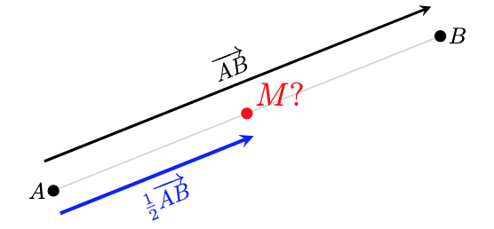
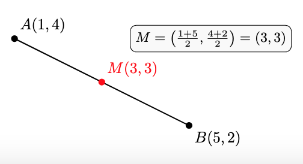
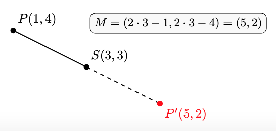
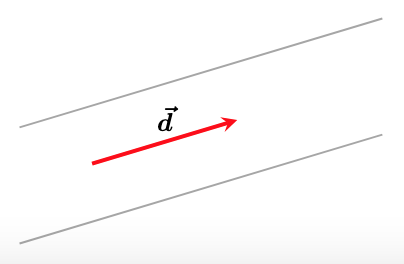
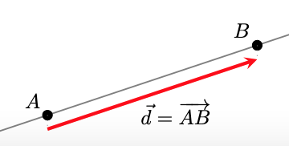
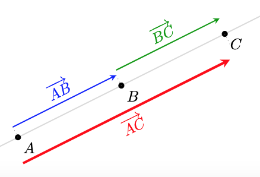
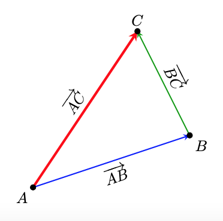

# Sistema de referència i punts al pla

## 1. El Sistema de Referència
Per poder descriure la posició d'un punt, o qualsevol altre objecte geomètric, necessitarem un **sistema de referència** $R = \{O;\{\vec{i}, \vec{j}\}\}$. Com podem veure, un sistema de referència, consta de dos elements:

* **L'origen ($O$):** Un punt fix de referència (de coordenades $(0,0)$).
* **Una base ($\{\vec{i}, \vec{j}\}$):** Una base de vectors qualsevol (o sigui, dos vectors linealment independents). No obstant això, treballarem amb la base ortonormal, ja que ens facilita molts càlculs.

!!! example "Exemple"
    Per entendre la necessitat d'un sistema de referència, analitzem la següent situació: hem d'entrar a una habitació i ens hem de situar en un punt concret. Per arribar-hi, la indicació que ens donen és la següent: "ens hem de moure 4 metres". Analitzem per què sense un sistema de referència aquesta indicació no serveix de res:

    * Ens hem de moure 4 metres... però **des d'on?** Ens cal un punt inicial des del qual moure'ns. Aquest punt és l'origen $O$.
    * I ara que sé des d'on... **cap on ens movem?** ens cal una direcció i un sentit. Ja hem vist que això son característiques dels vectors, per tant una base de vectors que ens permeti escriure qualsevol direcció des de l'origen $O$, dona resposta a les nostres necessitats. 

---

## 2. Localitzem i identifiquem els punts del pla: **vectors de posició**
Ara que tenim un sistema de referència, el primer objectiu que tenim és poder **identificar** tots els punts del pla i associar-los unes **coordenades** que ens permetin **distingir-los** i treballar amb ells.  

**Com ho fem?** Per a qualsevol punt $A$ del pla, hi ha un **únic vector** que surt d'$O$ (extrem inicial) i arriba a $A$ (extrem final). Associem, doncs, aquest vector al punt $A$.  
D'aquest tipus de vectors en diem **vectors de posició** i utilitzem la notació $\overrightarrow{OA}$ per anomenar-los.  
**Com assignem coordenades al punt?** Com el vector $\overrightarrow{OA}$, amb components $(a,b)$, està unívocament vinculat al punt $A$ (respecte $O$), assignem aquestes mateixes components com a coordenades del punt. Ho escrivim: $\mathbf{A(a,b)}$.

!!! Example "Al següent exemple gràfic observem com el vector $\overrightarrow{OP}$ "apunta" des de l'origen $O$ al punt $P$. Les components del vector $\overrightarrow{OP}$ les associem com a coordenades del punt $P$"
    

!!! Tip "Si hi pensem, aquestes coordenades dels punts són exactament iguals a les que hem fet servir sempre quan representem punts a partir dels eixos de coordenades cartesians. Això és perquè utilitzem una base ortonormal i, de fet, ens facilita la representació i els càlculs. Si la base fos una altra, això no seria així!"

## 3. Com puc anar d'un punt a un altre? **Vector entre dos punts**

Donats dos punts $A$ i $B$ qualssevol del pla, hi ha un únic vector que surt d'$A$ i té com a extrem final $B$. A aquest vector l'anomenem $\overrightarrow{AB}$. 

!!! Note "Al següent gràfic observem com el vector $\overrightarrow{AB}$ té com a inici $A$ i com a extrem final $B$"
    

**Què ens diu el vector $\mathbf{\overrightarrow{AB}}$?** El vector $\overrightarrow{AB}$ ens diu com arribar del punt $A$ al punt $B$, o sigui, com m'he de moure des d'$A$ per arribar $B$. Si ho mirem vectorialment i tal com interpretem la suma de vectors ja ho veiem:

$$\overrightarrow{OA} + \overrightarrow{AB} = \overrightarrow{OB}$$

!!! Note ""
    

Com que els vectors de posició $\overrightarrow{OA}$ i $\overrightarrow{OB}$ s'identifiquen amb els punts $A$ i $B$, a partir d'ara, i per simplificar les expressions, els vectors de posició els escriurem com a punts:

$$A + \overrightarrow{AB} = B$$

i podem pensar que, si a un punt $A$ li apliquem (sumem) un vector ($\overrightarrow{AB}$), aquest ens transporta a un altre punt ($B$).

**I com podem calcular el vector entre dos punts?** A partir de l'expressió anterior, i també si mirem la interpretació geomètrica de la resta de vectors, tenim que:

$$A + \overrightarrow{AB} = B \implies   \overrightarrow{AB} = B-A$$

Si tenim els punts $A(x_A,y_A)$ i $B(x_B,y_B)$, el vector , $\overrightarrow{AB}$, que els uneix es calcula com:

$$\overrightarrow{AB} = B - A = (x_B - x_A, y_B - y_A)$$

!!! Example "Vegem un exemple gràfic amb coordenades. És fàcil veure que el vector $\overrightarrow{AB}$ ens diu com canvien, o quina és la diferència entre, les coordenades dels punts $A$ i $B$."
    

!!! Example "Observem que si apliquem el vector $\overrightarrow{AB}=(4,1)$ al punt $A(1,3)$ obtenim el punt $B(5,4)$:"
    
    $$A+\overrightarrow{AB} = (1,3)+(4,1)=(5,4)=B$$

##4. Punt mitjà
Un problema que podem resoldre amb el que hem vist fins ara, és com trobar el **punt mitjà**, $M$, entre 2 punts donats $A(x_A,y_A)$ i $B(x_B,y_B)$.

!!! Note "Observem que el el vector meitat d'$\overrightarrow{AB}$ ens porta fins al punt meitat que cerquem"
    

**Càlcul de les coordenades del punt mitjà:**

* Calculem $\overrightarrow{AB}$: $(x_B-x_A,y_B-y_A)$
* Calculem $\displaystyle\frac{1}{2}\overrightarrow{AB}=\left(\frac{x_B-x_A}{2},\frac{y_B-y_A}{2}\right)$
* Si al punt $A$ li aplico $\displaystyle\frac{1}{2}\overrightarrow{AB}$ arribo al punt mitjà, $M$, entre $A$ i $B$
* Fem $M=A+\displaystyle\frac{1}{2}\overrightarrow{AB}=\left( x_A+\frac{x_B-x_A}{2}, y_A+\frac{y_B-y_A}{2} \right)$
* Obtenim:
  
$$\mathbf{M=\left( \frac{x_A+x_B}{2},\frac{y_A+y_B}{2} \right)}$$

!!! Example "Vegem un exemple gràfic amb coordenades:"
    

##5. Punt simètric

Una variant del problema anterior és com trobar el **punt simètric**, $P'$, d'un punt $P(x_P,y_P)$, respecte d'un punt de simetria, $S(x_S,y_S)$. En lloc d'aplicar el vector meitat, apliquem el vector doble: 

$$P'= P+2\overrightarrow{PS}$$

$$\mathbf{P'=(2x_S-x_P,2y_S-y_P)}$$

!!! Example "Vegem un exemple gràfic amb coordenades:"
    

##6. Quan només m'interessa la direcció: **vectors directors**
Hi ha moltes situacions en què l'interessant d'un vector és la direcció i no entre quins punts es troba. En aquests contexts els anomenarem **vectors directors**.

Per representar un vector director utilitzarem una lletra minúscula com per exemple $\vec{d}$ 

!!! Note "En la següent representació podem veure que la informació que en dona el vector $\vec{d}$ és la de la direcció de les rectes que es mostren. No representa a cap punt ni ens importa si està entre dos punts concrets."
    

Si dos vectors $\vec{d_1}=(x_{d1},y_{d1})$ i $\vec{d_2}=(x_{d2},y_{d2})$ tenen la mateixa direcció, llavors són proporcionals:

$$\vec{d_1} \parallel \vec{d_2} \implies \vec{d_1}=k\cdot \vec{d_2} \implies \frac{x_{d1}}{x_{d2}}=\frac{y_{d1}}{y_{d2}}$$

!!! example "Exemple numèric: Comprovació de proporcionalitat"
    Anem a verificar si els vectors $\vec{u} = (2, 3)$ i $\vec{v} = (4, 6)$ tenen la mateixa direcció:

    **Mètode vectorial:** Busquem si existeix un nombre $k$ tal que $\vec{v} = k \cdot \vec{u}$:

    $$(4, 6) = k \cdot (2, 3) \implies (4, 6) = (2k, 3k)$$
    
    Si aïllem la $k$ en ambdues coordenades:

    * $4 = 2k \implies k = 2$
    * $6 = 3k \implies k = 2$
    
    Com que $k$ és la mateixa, diem que $\vec{v} = 2\vec{u}$.

    ---

    **Mètode per components:** Dividim les coordenades $x$ i $y$ dels dos vectors:
    
    $$\frac{v_x}{u_x} = \frac{4}{2} = 2$$

    $$\frac{v_y}{u_y} = \frac{6}{3} = 2$$
    
    

    **Conclusió:** Com que la raó és constant ($2 = 2$), els vectors són **proporcionals** i, per tant, **paral·lels**.

Hi ha situacions en què la informació que ens interessarà del vector entre dos punts $A$ i $B$ és la direcció. Per exemple, ens pot interessar la direcció de la recta que passa per aquests dos punts. En aquest context el vector $\overrightarrow{AB}$ fa les funcions d'un vector director $\vec{d}$

!!! Note "En la següent representació podem veure que el vector  $\overrightarrow{AB}$ el podem entendre com el vector director $\vec{d}$ de la recta que conté a $A$ i $B$"
    

##7. Punts alineats

Amb tot el que tenim, ja podem fer front a un altre problema: donats tres punts qualssevol $A$, $B$ i $C$ volem saber si estan alineats o no.  
**Què passa si estan alineats?** Si els tres punts estan alineats els vectors $\overrightarrow{AB}$ i $\overrightarrow{BC}$ (o $\overrightarrow{AC}$) tenen la mateixa direcció, o sigui són proporcionals, i aquesta és la condició que ens permet comprovar si estan alineats o no.

!!! Note "Aquí observem els tres punts alineats i com les direccions dels vectors entre tots els punts són la mateixa i, per tant, són proporcionals"
    

!!! Note "Aquí observem els tres punts no alineats i com les direccions dels vectors entre tots els punts no tenen les mateixes direccions i, per tant, no són proporcionals"
    

**Condició analítica (per coordenades)**

Per verificar si tres punts estan alineats sense necessitat de dibuixar-los, treballem amb les seves coordenades. Siguin els punts:
$A(x_1, y_1)$, $B(x_2, y_2)$ i $C(x_3, y_3)$.

* **Pas 1: Trobar els vectors entre els punts**  
Primer, calculem els components dels vectors $\vec{AB}$ i $\vec{BC}$:

$$\vec{AB} = (x_2 - x_1, \ y_2 - y_1)$$

$$\vec{BC} = (x_3 - x_2, \ y_3 - y_2)$$

* **Pas 2: Verificar la proporcionalitat**  
Els punts estan alineats si les coordenades dels vectors són proporcionals. Això es compleix si:

$$\frac{x_2 - x_1}{x_3 - x_2}=\frac{y_2 - y_1}{y_3 - y_2}$$

$$(x_2 - x_1) \cdot (y_3 - y_2) = (y_2 - y_1) \cdot (x_3 - x_2)$$

!!! Examples "Exemples numèrics:"

    **Cas A: Punts alineats**
    Comprovem si els punts $A(-1, -2)$, $B(1, 2)$ i $C(2, 4)$ estan alineats.

    Calculem els vectors entre els punts:

    * $\overrightarrow{AB} = (1 - (-1), 2 - (-2)) = (2, 4)$
  
    * $\overrightarrow{BC} = (2 - 1, 4 - 2) = (1, 2)$

    Verifiquem la proporció:

    $$\frac{2}{1} = \frac{4}{2} \implies 2 = 2$$

    ---

    **Cas B: Punts no alineats**

    Comprovem si els punts $P(0, 1)$, $Q(2, 3)$ i $R(4, 0)$ estan alineats.

    Calculem els vectors components:

    * $\overrightarrow{PQ} = (2 - 0, 3 - 1) = (2, 2)$
  
    * $\overrightarrow{QR} = (4 - 2, 0 - 3) = (2, -3)$

    Verifiquem la proporció:
   
    $$\frac{2}{2} \neq \frac{2}{-3}$$

