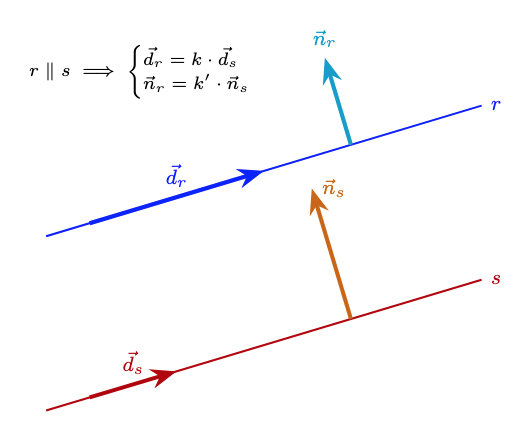
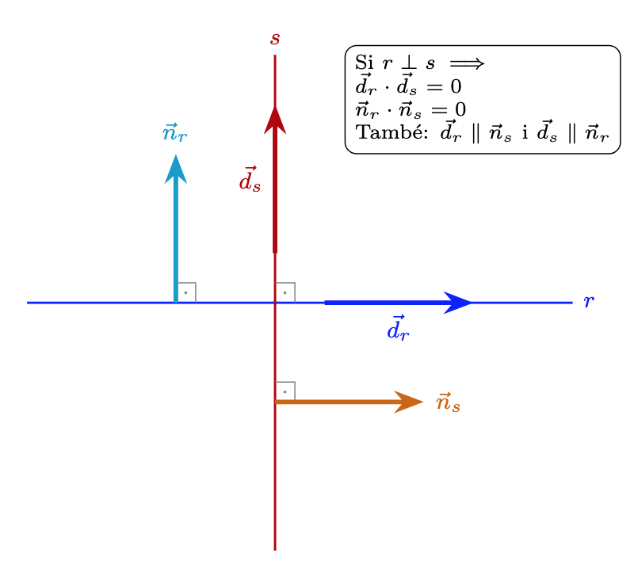

# Paral·lelisme i perpendicularitat

En aquest apartat analitzarem les relacions de paral·lelisme i perpendicularitat entre dues rectes $r$ i $s$ a partir dels seus elements característics: els vectors directors, els vectors normals i els pendents.

---

## 1. Paral·lelisme
Dues rectes són paral·leles ($r \parallel s$) si tenen la **mateixa direcció** i no són coincidents (no són la mateixa recta).

**Com comprovar si dues rectes tenen la mateixa direcció?**

* **Amb vectors directors:** Els vectors $\vec{d_r}$ i $\vec{d_s}$ han de ser **proporcionals**.
  
    $$\vec{r} \parallel \vec{s} \iff \vec{d_r} = k \cdot \vec{d_s} \iff \frac{d_{rx}}{d_{sx}} = \frac{d_{ry}}{d_{sy}}$$

* **Amb els pendents:** Les rectes han de tenir el **mateix pendent**.
  
    $$\vec{r} \parallel \vec{s} \iff m_r = m_s$$

* **Amb vectors normals:** Els seus vectors normals també han de ser proporcionals.
  
    $$\vec{r} \parallel \vec{s} \iff \vec{n_r} = k \cdot \vec{n_s}$$

Observem gràficament com els vectors directors (i els normals) de les dues rectes han de tenir la mateixa direcció per a que les rectes siguin paral·leles:
{width=75%}

**Com comprovar si dues rectes són paral·leles o coincidents?**

Dues rectes paral·leles no tenen cap punt en comú i dues rectes coincidents els tenen tots en comú, per tant, si prenem un punt d'una recta i comprovem si pertany o no a l'altra, ja sabrem si són coincidents o paral·leles.

!!! example "Exemple: Comprovació de paral·lelisme"
    Donades les rectes:  

    $$r: 2x - 3y + 5 = 0 \implies \vec{d_r} = (3, 2)$$ 
    
    $$s: y = \frac{2}{3}x + 1 \implies m_s = \frac{2}{3}$$

    **Comprovació:**

    1. Com que $\vec{d_r} = (3, 2)$, el pendent de $r$ és $m_r =\displaystyle \frac{2}{3}$.  
    2. Com que $m_r = m_s =\displaystyle \frac{2}{3}$, les rectes tenen la mateixa direcció.
    3. Vegem si són o no coincidents: el punt $(0,1)\in s$, però no compleix l'equació de $\mathbf{r}$: $2\cdot 0-3\cdot1 +5 \neq 0$, per tant **són paral·leles**.

!!! example "Exemple de trobar una paral·lela a una recta donada"
  
    Troba l'equació de la recta $s$ que és paral·lela a $r: 3x - 4y + 5 = 0$ i que passa pel punt $P(2, -1)$.

    **Mètode 1: Utilitzant l'equació general**

    Si dues rectes són paral·leles, els seus coeficients $A$ i $B$ són idèntics (o proporcionals). Per tant, la recta $s$ tindrà la forma:

    $$3x - 4y + C = 0$$

    Només ens falta trobar el nou valor de $C$ substituint les coordenades del punt $P(2, -1)$:

    * Substituïm $x = 2$ i $y = -1$:
  
    $$3(2) - 4(-1) + C = 0$$

    $$6 + 4 + C = 0$$
    
    $$10 + C = 0 \implies C = -10$$

    * **Resultat:** L'equació de la recta paral·lela és: $\mathbf{s: 3x - 4y - 10 = 0}$

    **Mètode 2: Utilitzant el vector director**

    * De la recta $r: 3x - 4y + 5 = 0$, el vector normal és $\vec{n} = (3, -4)$. Per tant, el vector director és $\vec{d} = (4, 3)$.
    * Com que $s \parallel r$, la recta $s$ té el mateix vector director $\vec{d} = (4, 3)$ i passa per $P(2, -1)$.
    * Equació contínua:
  
    $$\frac{x - 2}{4} = \frac{y + 1}{3}$$

    * Equació general: multipliquem en creu:
  
    $$3(x - 2) = 4(y + 1) \implies 3x - 6 = 4y + 4 \implies \mathbf{3x - 4y - 10 = 0}$$

---

## 2. Perpendicularitat
Dues rectes són perpendiculars ($r \perp s$) si es tallen formant un **angle de $90^\circ$**.

### Com comprovar la perpendicularitat?

* **Amb vectors directors:** El **producte escalar** dels seus vectors directors ha de ser **zero** (vectors ortogonals).
  
    $$r \perp s \iff \vec{d_r} \cdot \vec{d_s} = 0 \iff d_{rx} \cdot d_{sx} + d_{ry} \cdot d_{sy} = 0$$

* **Amb els pendents:** El pendent d'una recta és l'oposat de l'invers de l'altra.
  
    $$r \perp s \iff m_r \cdot m_s = -1 \implies m_s = -\frac{1}{m_r}$$

* **Amb vectors normals:** Els vectors normals de les rectes també tenen producte escalar zero (també són ortogonals). 

$$r \perp s \iff \vec{n_r} \perp \vec{n_s} \iff \vec{n_r}\cdot \vec{n_s}=0$$

* A més el **vector normal** d'una recta ha de ser paral·lel al **vector director** de l'altra.
  
$$r \perp s \iff  \vec{n_r} \parallel \vec{d_s}$$

Observem gràficament com els vectors directors (i els normals) de les dues rectes han de ser ortogonals perquè les rectes siguin perpendiculars:
{width=80%}

!!! example "Exemple: Trobar una recta perpendicular"
    Troba l'equació de la recta $s$ perpendicular a $r: y = 2x - 3$ que passa pel punt $P(1, 4)$.

    1. El pendent de $r$ és $m_r = 2$.
    2. El pendent de la recta perpendicular serà $m_s = \displaystyle-\frac{1}{2}$.
    3. Fem servir l'equació punt-pendent:
   
    $$y - 4 = -\frac{1}{2}(x - 1)$$

---

## 3. Identificació d'elements característics segons l'equació

A la següent taula es resumeix com extreure el **vector director** ($\vec{d}$), el **vector normal** ($\vec{n}$) i el **pendent** ($m$) a partir de les diferents formes de l'equació de la recta.

| Tipus d'equació | Expressió matemàtica | Vector director $\vec{d}$ | Vector normal $\vec{n}$ | Pendent $m$ |
| :--- | :--- | :--- | :--- | :--- |
| **Paramètrica** | $\begin{cases} x = x_A + k \cdot d_1 \\ y = y_A + k \cdot d_2 \end{cases}$ | $(d_1, d_2)$ | $(-d_2, d_1)$ | $\displaystyle\frac{d_2}{d_1}$ |
| **Contínua** | $\displaystyle\frac{x - x_A}{d_1} = \frac{y - y_A}{d_2}$ | $(d_1, d_2)$ | $(-d_2, d_1)$ | $\displaystyle\frac{d_2}{d_1}$ |
| **Explícita** | $y = mx + n$ | $(1, m)$ | $(-m, 1)$ | $m$ |
| **General** | $Ax + By + C = 0$ | $(-B, A)$ | $(A, B)$ | $\displaystyle-\frac{A}{B}$ |

!!! tip "Observació sobre el pas de director a normal"
    Recorda que per qualsevol recta, el vector director i el vector normal són sempre perpendiculars entre ells $(\vec{d} \cdot \vec{n} = 0)$. Per això, si coneixes $\vec{d} = (v_1, v_2)$, pots obtenir $\vec{n}$ intercanviant les coordenades i canviant un signe: $\vec{n} = (-v_2, v_1)$.

## 4. Exemple pràctic

Partirem d'una recta escrita en **forma vectorial** i mirarem el paral·lelisme i ortogonalitat respecte d'altres rectes:

$$r: (x, y) = (1, 3) + k \cdot (2, -1)$$

* **Punt conegut ($P_r$):** $(1, 3)$
* **Vector director ($\vec{d_r}$):** $(2, -1)$

**Cas 1: Rectes Perpendiculars**

Donada la recta $s$ en forma contínua:

$$\frac{x - 1}{2} = \frac{y - 3}{4}$$

* El **vector director** de $s$ són els denominadors de l'equació contínua: $\vec{d}_s = (2, 4)$.
* Mirem si els vectors, $d_r$ i $d_s$, són **proporcionals**:
  
$$\frac{2}{2} \neq \frac{-1}{4}$$

* Per tant, les rectes **no són paral·leles** i es tallen.
* Comprovem l'ortogonalitat dels vectors directors: 
 
$$\vec{d_r} \cdot \vec{d_s} = 2\cdot 2 + (-1)\cdot 4 = 0 \implies r \perp s$$

* **Conclusió:** Les rectes són **perpendiculars**.

**Cas 2: Rectes Paral·leles**

Donada la recta $t$ en forma general:

$$x + 2y + 8 = 0$$

* El vector **normal** és $\vec{n}_t = (1, 2)$, per tant el **director** és $\vec{d}_t = (-2, 1)$.
* $\vec{d}_r = (2, -1)$ i $\vec{d}_t = (-2, 1)$ **són proporcionals**: $\vec{d_r}=-1\cdot \vec{d_s}$.
*  Mirem si el punt $P_r(1, 3)$ satisfà l'equació de $t$:
  
$$1 + 2(3) + 8 = 15 \neq 0$$

* **Conclusió:** Tenen la mateixa direcció, però no comparteixen punts, per tant, són **paral·leles**.

**Cas 3: Rectes Coincidents**

Donada la recta $u$ en forma paramètrica:

$$\begin{cases} x = 3 + 4\lambda \\ y = 2 - 2\lambda \end{cases}$$

* El vector director és $\vec{d}_u = (4, -2)$.
* $\vec{d_u} = (4, -2)$ és proporcional a $\vec{d_r} = (2, -1)$: $\vec{d_u}=2\cdot \vec{d_r}$.
* Substituïm $P_r(1, 3)$ a les equacions de $u$:
  
$$1 = 3 + 4\lambda \implies \lambda = -0.5$$

$$3 = 2 - 2\lambda \implies \lambda = -0.5$$

* **Conclusió:** Tenen la mateixa direcció i tots els punts comuns, o sigui, són **coincidents**.

