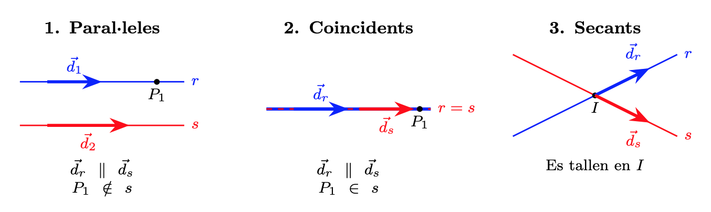

#Posició relativa de dues rectes al pla

Un cop hem estudiat el paral·lelisme i la perpendicularitat, podem analitzar més generalment com podem trobar dues rectes, $r$ i $s$, al pla.

## Els tres casos possibles
Al pla, dues rectes només es poden trobar en una d'aquestes tres situacions:

1.  **Rectes paral·leles:** Les rectes no es tallen mai (no tenen punts en comú).
2.  **Rectes coincidents:** Són la mateixa recta (tenen tots els punts en comú).
3.  **Rectes secants:** Les rectes es tallen en un únic punt (la perpendicularitat és un cas particular de dues rectes secants).

Vegem gràficament aquestes tres possibilitats de posició relativa entre dues rectes:

{width=95%}

---

## Estudi segons el vector director
Si disposem dels vectors directors de les dues rectes, $\vec{d}_r$ i $\vec{d}_s$, l'anàlisi per determinar la posició relativa de les dues rectes segueix aquest ordre lògic:

* **Pas 1: Comprovar la direcció.** Mirem si els vectors directors són proporcionals $(\vec{d}_r = k \cdot \vec{d}_s)$.
    * Si **no són** proporcionals: Les rectes són **secants** i es tallen en un únic punt. Aquest punt ha de ser solució de les dues equacions de les rectes.
    * Si **són** proporcionals: Pot passar que sigui **paral·leles** o **coincidents** i per determinar-ho, passem al segon pas.

* **Pas 2: Comprovar un punt.** Agafem un punt qualsevol de la primera recta ($P_r \in r$) i mirem si pertany a la segona ($s$):
    * Si $P_r \notin s$: Les rectes són **paral·leles**.
    * Si $P_r \in s$: Les rectes són **coincidents**.

---

## Estudi segons l'Equació General
Aquest mètode és el més ràpid si tenim les rectes expressades en forma general:

$$r: Ax + By + C = 0$$

$$s: A'x + B'y + C' = 0$$

Simplement hem de comparar les raons dels seus coeficients:

1. **Rectes secants**
Els coeficients de $x$ i $y$ no mantenen la mateixa proporció. Això indica diferent direcció o pendent de cada recta:

$$\frac{A}{A'} \neq \frac{B}{B'}$$

1. **Rectes paral·leles**
Els coeficients de $x$ i $y$ són proporcionals, però el terme independent no ho és:

$$\frac{A}{A'} = \frac{B}{B'} \neq \frac{C}{C'}$$

3. **Rectes coincidents**
Tots els coeficients mantenen la mateixa proporció (una equació és múltiple de l'altra):

$$\frac{A}{A'} = \frac{B}{B'} = \frac{C}{C'}$$

!!! example "Estudi de posicions relatives"

    Donada la recta **$r: 2x - 4y + 6 = 0$**, determina la posició relativa respecte a les següents rectes:

    **Recta** $\mathbf{s: 3x - 6y + 9 = 0}$
    
    * Comparem les raons:

    $$\frac{A}{A'} = \frac{2}{3}$$

    $$\frac{B}{B'} = \frac{-4}{-6} = \frac{2}{3}$$

    $$\frac{C}{C'} = \frac{6}{9} = \frac{2}{3}$$

    * **Conclusió:** Com que $\displaystyle\frac{2}{3} = \frac{2}{3} = \frac{2}{3}$, totes les raons són iguals. Les rectes són **COINCIDENTS**.

    **Recta** $\mathbf{t: x - 2y + 5 = 0}$

    * Comparem les raons:

    $$\frac{A}{A'} = \frac{2}{1} = 2$$

    $$\frac{B}{B'} = \frac{-4}{-2} = 2$$
 
    $$\frac{C}{C'} = \frac{6}{5} = 1.2$$

    * **Conclusió:** Com que $\displaystyle\frac{A}{A'} = \frac{B}{B'} \neq \frac{C}{C'}$, tenen la mateixa direcció però diferent ordenada a l'origen. Les rectes són **PARAL·LELES**.

    **Recta** $\mathbf{u: 3x + y - 2 = 0}$
    
    * Comparem les raons:

    $$\frac{A}{A'} = \frac{2}{3}$$

    $$\frac{B}{B'} = \frac{-4}{1} = -4$$

    * **Conclusió:** Com que $\frac{2}{3} \neq -4$, la proporció dels coeficients directors ja és diferent. No cal ni mirar el terme $C$. Les rectes són **SECANTS**.

---

## Taula resum de les raons

| Comparació | Tipus de sistema | Posició Relativa |
| :--- | :--- | :--- |
| $\frac{A}{A'} \neq \frac{B}{B'}$ | Sistema Compatible Determinat | **Secants** (1 punt de tall) |
| $\frac{A}{A'} = \frac{B}{B'} \neq \frac{C}{C'}$ | Sistema Incompatible | **Paral·leles** (0 punts comuns) |
| $\frac{A}{A'} = \frac{B}{B'} = \frac{C}{C'}$ | Sistema Compatible Indeterminat | **Coincidents** (infinits punts, són la mateixa recta) |

---

## Càlcul del punt de tall entre rectes secants

Quan hem determinat que dues rectes són **secants** ($\frac{A}{A'} \neq \frac{B}{B'}$), sabem que es tallen en un únic punt $I(x_0, y_0)$. Aquest punt és la solució del sistema d'equacions format per les dues rectes.

O sigui, per trobar el punt de tall, hem de resoldre el sistema:

$$
\begin{cases} 
Ax + By + C = 0 \\
A'x + B'y + C' = 0 
\end{cases}
$$

Podem utilitzar qualsevol dels mètodes habituals (substitució, igualació o reducció).

---

!!! example "Exemple"
    Troba el punt de tall entre les rectes secants:

    $r: 2x - 3y + 5 = 0$
    
    $s: x + 2y - 8 = 0$

    **Mètode de reducció**   
    Volem eliminar una de les incògnites. Multipliquem la segona equació ($s$) per $-2$ per eliminar la $x$:

    * Mantenim $r$: $2x - 3y = -5$
    * Multipliquem $s$ per $-2$: $-2x - 4y = -16$
    * Sumem les dues equacions:
   
    $$(2x - 2x) + (-3y - 4y) = -5 - 16$$

    $$-7y = -21 \implies y = \frac{-21}{-7} = 3$$

    * Substituïm $y=3$ a la recta $s$:
   
    $$x + 2(3) - 8 = 0 \implies x + 6 - 8 = 0 \implies x = 2$$

    * **Punt de tall:** $I(2, 3)$

    **Mètode de substitució**
    Aquest mètode és útil si una de les incògnites és fàcil d'aïllar (com la $x$ a la recta $s$):

    * Aïllem $x$ de la recta $s$:
    
    $$x = 8 - 2y$$
 
    * Substituïm aquesta expressió a la recta $r$:
  
    $$2(8 - 2y) - 3y + 5 = 0$$

    $$16 - 4y - 3y + 5 = 0$$

    $$21 - 7y = 0 \implies 7y = 21 \implies y = 3$$
    
    * Trobem la $x$:
    
    $$x = 8 - 2(3) = 2$$

    * **Punt de tall:** $I(2, 3)$

