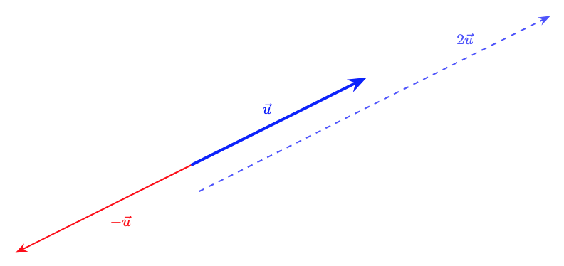
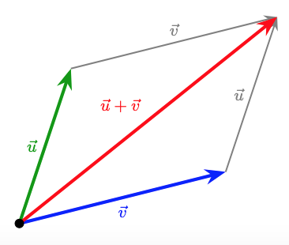

# Els Vectors al Pla

## 1. Necessitat de les magnituds vectorials
No totes les magnituds físiques es poden descriure completament amb un sol número (magnitud **escalar**, com la massa o la temperatura). N'hi ha d'altres que necessiten altra informació: la **direcció** i el **sentit**.

* **Exemple 1 (Velocitat):** Dir que un avió vola a 800 km/h és insuficient; necessitem saber en quina **direcció** ho fa (per exemple, la línia Barcelona-París) i en quin **sentit** (cap al Nord o cap al Sud).
* **Exemple 2 (Força):** Si empenys un objecte amb una força $\vec{F}$, el resultat serà diferent si empenys cap a la dreta (per moure'l) o cap avall (per aixafar-lo).
* **Exemple 3 (Força):** Si vols obrir una porta, a banda del mòdul i la direcció de la força, cal un sentit. En un sentit s'obre i en l'altre es tanca.

## 2. Definició de vector
Geomètricament, un vector $\vec{v}$ es pot representar com un segment orientat (com una fletxa). Un vector es caracteritza per tenir:

* **Mòdul:** La longitud del segment. Es representa com $|\vec{v}|$.
* **Direcció:** La recta que conté el segment o qualsevol de les seves paral·leles.
* **Sentit:** Indicat per la punta de la fletxa.

Gràficament podem observar les característiques d'un vector de la següent forma:

{ style="border: 1px solid gray; padding: 5px" }

## 3. Operacions geomètriques amb vectors
* **Producte per un escalar:** El producte d'un número (un escalar) $k$ per un vector $\vec{u}$ és un nou vector $k \cdot \vec{u}$ amb la mateixa direcció. Si $k>0$, el sentit es manté, en canvi, si $k < 0$, el sentit s'inverteix. El mòdul del vector quedarà multiplicat per $k$:

$$|k \cdot \vec{u}|=k \cdot |\vec{u}|$$

* **Vector oposat:** El vector $-\vec{u}$ té el mateix mòdul i direcció que $\vec{u}$, però el sentit contrari. En definitiva, s'obté multiplicant $\vec{u}$ per $-1$

{ style="border: 1px solid gray; padding: 5px" }

* **Suma de vectors:** Es defineix geomètricament col·locant l'origen de $\vec{v}$ a l'extrem de $\vec{u}$. El vector suma $\vec{u} + \vec{v}$ és el que va de l'origen de $\vec{u}$ a l'extrem de $\vec{v}$. En la representació següent, a més, s'observa la conmutativitat d'aquesta operació:

{ style="border: 1px solid gray; padding: 5px" }

* **Resta de vectors:** La resta s'entén com la suma del primer amb l'oposat del segon:
    $\vec{u} - \vec{v} = \vec{u} + (-\vec{v})$

## 4. Combinació i independència lineal
* **Combinació lineal:** Un vector $\vec{w}$ és combinació lineal de $\vec{u}$ i $\vec{v}$ si existeixen dos nombres $a, b$ tals que:
    $\vec{w} = a\vec{u} + b\vec{v}$
* **Independència lineal:** Dos vectors $\vec{u}$ i $\vec{v}$ són linealment independents si no tenen la mateixa direcció. Al pla, qualsevol parell de vectors independents formen una **base**.

* Donada una base, tots els vectors es poden escriure, de forma única, com a combinació lineal dels vectors de la base. O sigui, tot vector $\vec{w}$ és pot escriure com $\vec{w} = a\vec{u} + b\vec{v}$ per a algun valor d'$a$ i $b$. D'aquesta forma podem associar $(a,b)$ al vector $\vec{w}$ i en diem les **components del vector**.

Si observem la següent representació, ho veurem tot plegat. $\vec{u}$ i $\vec{v}$ són dos vectors linealment independents i, per tant, són base. $\vec{w}$ s'escriu com a combinació lineal de la base $\{\vec{u},\vec{v}\}$ com $\vec{w} = a\vec{u} + b\vec{v}$ i, per tant, el podem expressar en components de la forma: $\vec{w}=(a,b)$ 

{ style="border: 1px solid gray; padding: 5px" }

## 5. Base ortonormal
Per treballar, utilitzarem una base concreta que ens facilitarà alguns càlculs: la **base ortonormal**. Diem que una base és ortonormal si els vectors d'aquesta base, que es representen amb $\vec{i}$ i $\vec{j}$, compleixen:

*  $\vec{i}$ i $\vec{j}$ són perpendiculars ($\vec{i} \perp \vec{j}$).
*  $\vec{i}$ i $\vec{j}$ tenen mòdul unitari ($|\vec{i}| = 1$ i $|\vec{j}| = 1$).

Qualsevol vector es pot escriure com a combinació lineal d'aquests: $\vec{v} = v_x \vec{i} + v_y \vec{j} = (v_x, v_y)$.

## 6. Operacions amb components
Donats els vectors $\vec{u} = (u_x, u_y)$ i $\vec{v} = (v_x, v_y)$:

* **Suma:** $\vec{u} + \vec{v} = (u_x + v_x, u_y + v_y)$
* **Resta:** $\vec{u} - \vec{v} = (u_x - v_x, u_y - v_y)$
* **Producte per escalar:** $k \cdot \vec{u} = (k \cdot u_x, k \cdot u_y)$

## 7. Producte escalar: idea de projecció
El producte escalar $\vec{u} \cdot \vec{v}$ neix de la idea que el producte dels mòduls té sentit si considerem la **projecció** d'un segment sobre l'altre. 
Geomètricament, és el producte del mòdul de $\vec{u}$ per la projecció de $\vec{v}$ sobre $\vec{u}$:

$$\vec{u} \cdot \vec{v} = |\vec{u}| \cdot (|\vec{v}| \cdot \cos \theta)$$

## 8. Càlcul en base ortonormal
Quan treballem en una base ortonormal, el producte escalar es simplifica a la suma dels productes de les seves components:
$\vec{u} \cdot \vec{v} = u_x \cdot v_x + u_y \cdot v_y$

## 9. Mòdul en base ortonormal
El mòdul d'un vector $\vec{v}$ es calcula a partir de la definició de producte escalar ($\vec{v} \cdot \vec{v} = |\vec{v}|^2$):
$|\vec{v}| = \sqrt{v_x^2 + v_y^2}$

## 10. Angle entre dos vectors
Podem calcular l'angle $\theta$ que formen dos vectors $\vec{u}$ i $\vec{v}$ combinant les expressions anteriorment vistes:

$$\cos \theta = \frac{\vec{u} \cdot \vec{v}}{|\vec{u}| \cdot |\vec{v}|} = \frac{u_x v_x + u_y v_y}{\sqrt{u_x^2 + u_y^2} \cdot \sqrt{v_x^2 + v_y^2}}$$
